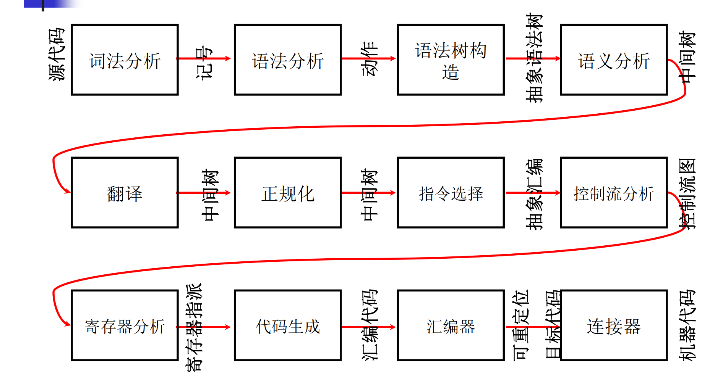

### 一、什么是编译器

计算设备包括个人计算机、大型机、嵌入式系统、智能设备等，在所有设备都运行着软件，大部分软件由高级语言编写。
而编译器就是将高级语言翻译为汇编或机器语言（机器可以直接执行）。

- 源代码:C/C++, Java, C#, html, SQL
- 目标代码:x86, IA64, ARM, MIPS

编译原理集中体现了计算机科学的很多核心思想
- 算法，数据结构，软件工程等
- 编译器是其他领域的重要研究基础
- 编译器本身就是非常重要的研究领域
- 新的语言设计大型软件的构造和维护

### 二、编译器的结构

编译器高度模块化，形成流水线结构

- 前端：词法，语法，语义，与源语言相关；中间表示形式，独立于语言
- 中间代码：可能会做优化
- 后端：与目标语言有关

实现中，各部分常常连在一起。在语法分析时，结合句子规格，直接进行语义分析，这一技术叫语法制导翻译（Syntax Directed Translation）。

### 三、编译器实例

1 + 2 + 3编译

1.词法分析阶段 value<1> op<+> value<2> op<+> value<3>

2.语法分析，语法树构建

3.代码生成，可能生成如下的机器代码

- push 1
- push 2
- add
- push 3
- add
- move
