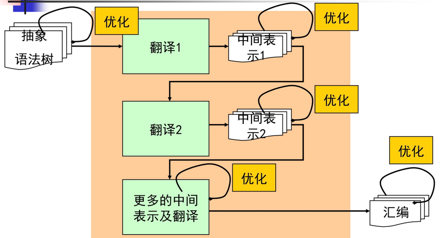
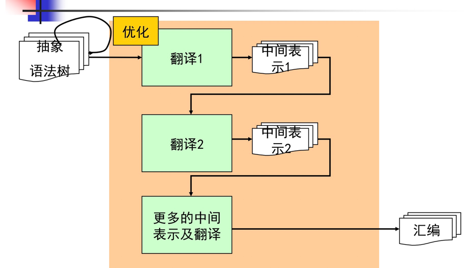
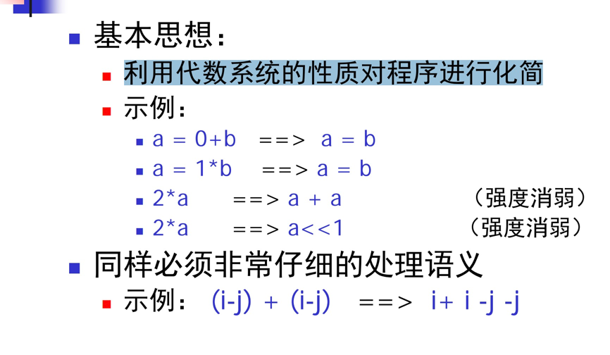
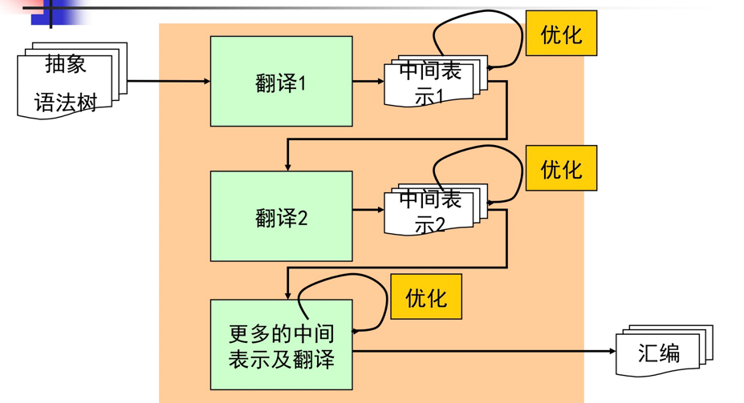
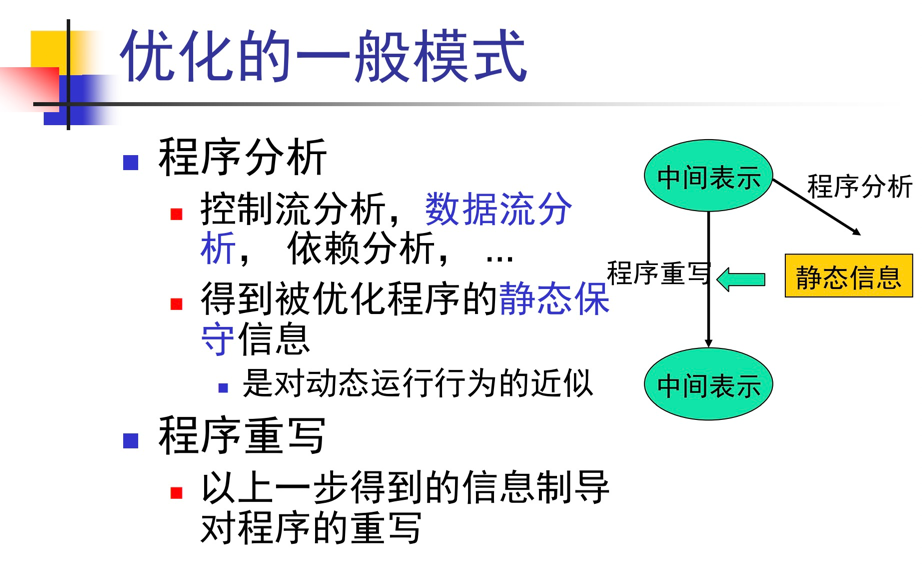
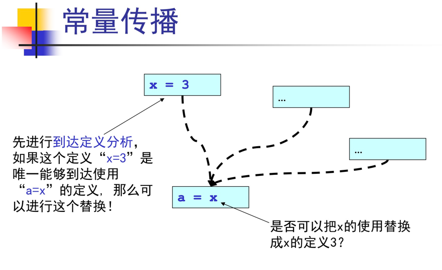
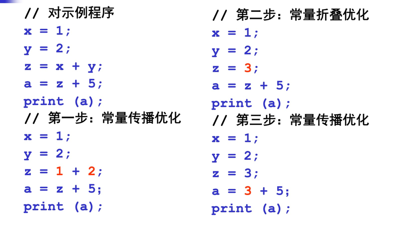
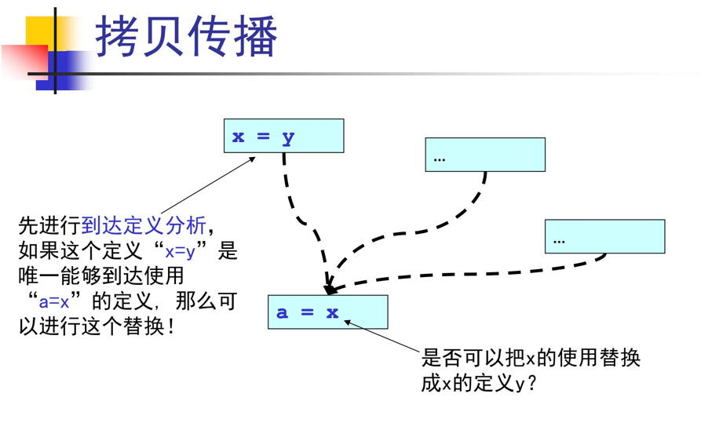

### 一、概述

代码优化发生在语义分析之后


- 代码优化是对被优化的程序进行的一种语义保持的变换
- 程序的可观察行为不能改变
- 变换的目的是让程序能够比变换前：更小，更快，cache行为更好，更节能等等

代码优化很困难
- 不能保证优化总能产生“好”的结果 
- 优化的顺序和组合很关键
- 很多优化问题是非确定的
- 优化的正确性论证很微妙

优化类型：
- 前端优化
    - 局部的、流不敏感的
    - 常量折叠、代数优化、死代码删除等
- 中期优化
    - 全局的、流敏感的
    - 常量传播、拷贝传播、死代码删除、公共字表达式删除等
- 后端优化
    - 在后端（汇编代码级）进行
    - 寄存器分配、指令调度、窥孔优化等

### 二、前端优化



1.常量折叠

在编译期计算表达式的值（静态可以计算），可以在整型、布尔型、浮点型等数据类型上进行

````
// 语法制导的常量折叠算法
const_fold(Exp_t e)
  while (e is still shrinking)
    switch (e->kind)
      case EXP_ADD:
        Exp_t l = e->left;
        Exp_t r = e->right;
        if (l->kind==EXP_NUM && r->kind==EXP_NUM)
          e = Exp_Num_new (l->value + r->value);
        break;
      default:
        break;
````

2.代数化简

利用代数系统的性质对程序进行化简


3.死代码删除

静态移除程序中不可执行的代码


### 三、中间表示上的优化



- 依赖于具体所使用的中间表示：控制流图（CFG）、控制依赖图（CDG）、静态单赋值形式（SSA）、后续传递风格（CPS）等
- 共同的特点是需要进行程序分析：优化是全局进行的，而不是局部，通用的模式是：程序分析 -> 程序重写



1.常量传播


````
// 常量传播算法
const_prop(Prog_t p)
  // 第一步：程序分析
  reaching_definition(p);
  // 第二步：程序改写
  foreach (stm s in p: y = x1, ..., xn)
    foreach (use of xi in s)
      if(the reaching def of xi is unique: xi = n)
        y = x1, ..., xi-1, n, xi+1, ..., xn
````



2.拷贝传播




