### 一、概述

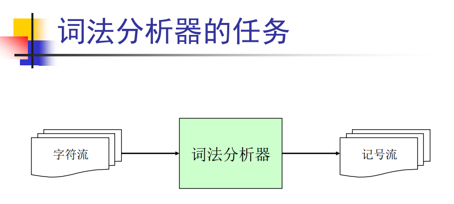

词法分析将输入的字符变为记号流

- 从左向右逐行扫描源程序的字符，识别出各个单词，确定单词的类型。
- 将识别出的单词转换成统一的机内表示——词法单元（token）形式
- token：< 种别码，属性值>

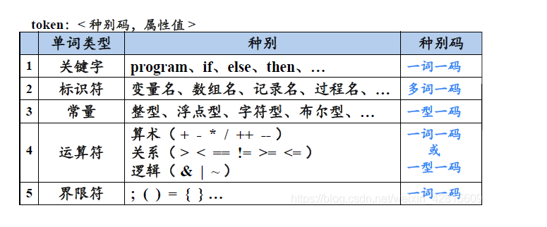

如上图，标识符、常量是开放的集合，因此对于标识符，都分配一个“码”，用属性值区分其不同值；而对于常量，每一个型一种“码”，用属性值区分不同值。

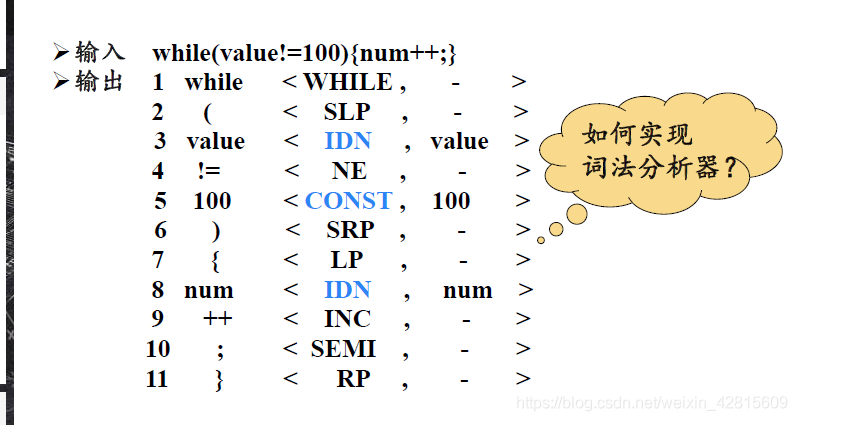

如何从输入序列转化为token

### 二、手工构造法

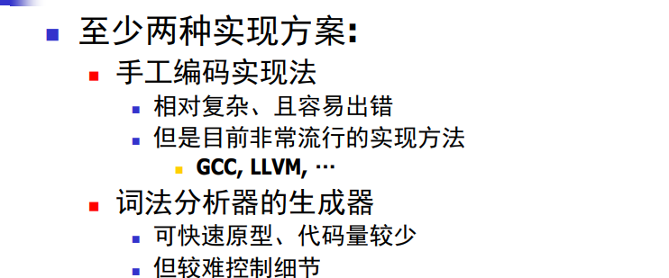

1.转移图

对于<= <> < = >= >六种符号可以画出转移图（状态机？）

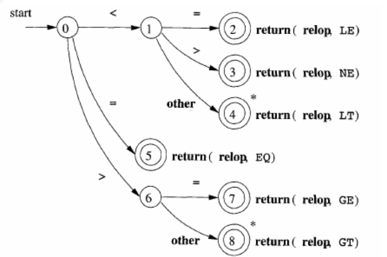

转移图算法
```
token nextToken() {
    c = getChar();
    switch(c) {
        case "<" :
            c = getChar();
            switch(c) {
                case "=" return LE;
                case ">" return NE;
                default rollback() return LT;
            }
        
        case "=" return EQ;
        case ">" //...类似
    }
}
```

2.标识符转移图（即定义变量语句）

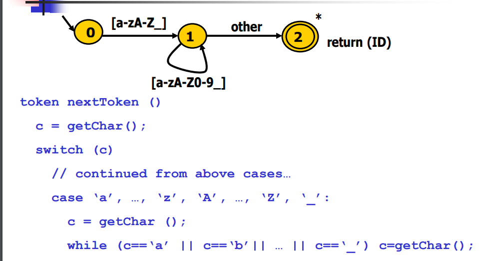

3.关键字识别

可以合并到标志符识别的逻辑
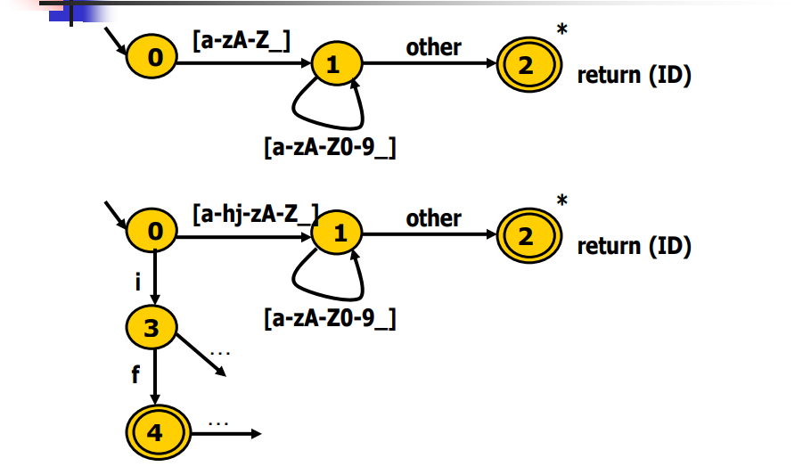

开出分支对if进行特殊处理


### 三、自动生成技术-正则表达式

1.正则表达式定义
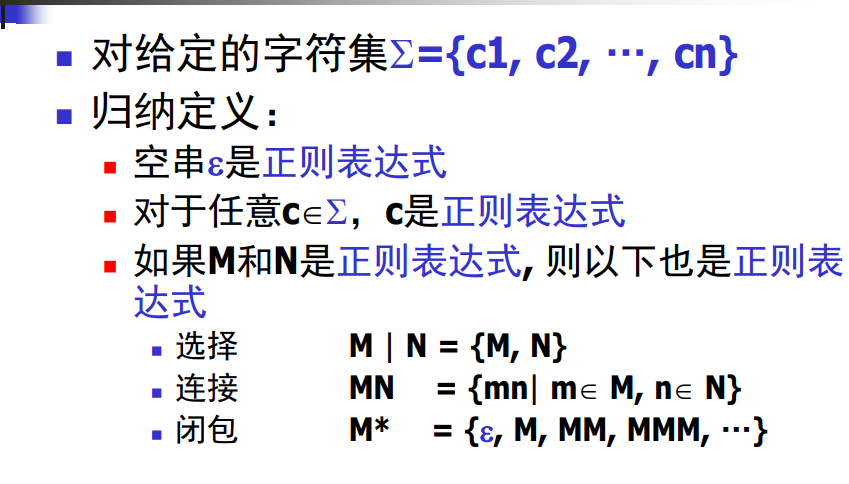

- 选择：多个表达式中选择其中一个
- 连接：多个表达式连接
- 闭包：空串或多个自身表达式

注：正则表达式的基础定义只有三个，其他的都是一些语法糖，由这三个定义操作而得。

2.正则表达式形式表示
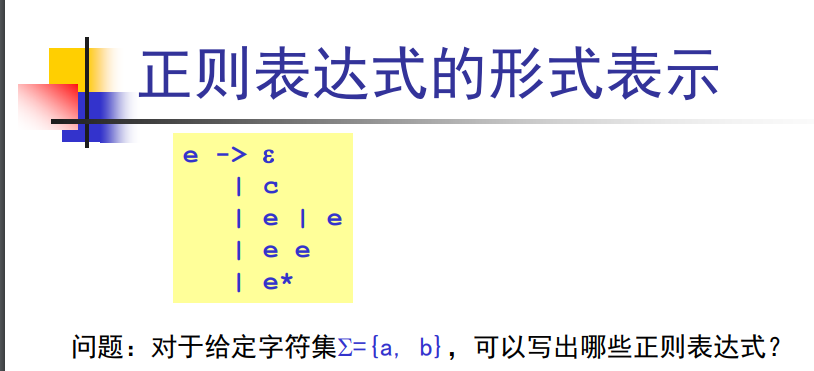

- e
- a | b
- e | a, e | b, a | b......
- ea, ea, ab, ee.....
- e*, (a(e|a))*......

那么其他程序中所有的关键字和标识符都可以用正则表达式去描述。

### 四、有限状态自动机FA

1.定义
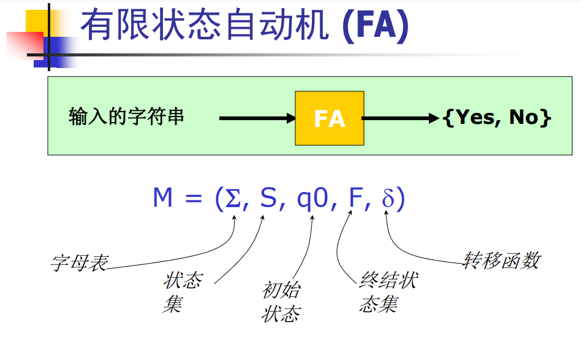

例1：
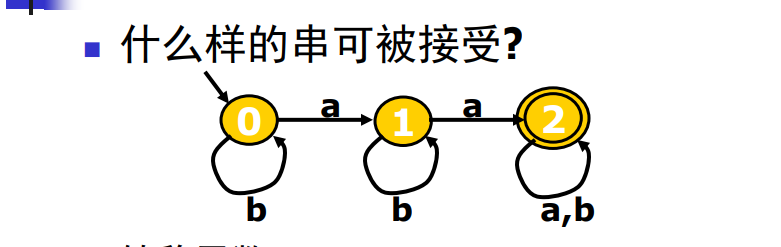

- 字母表：{a,b}
- 状态集：{0,1,2}
- q0：由单项输入的状态就是初始态 0
- F：双圈表示{2}
- 转移函数：
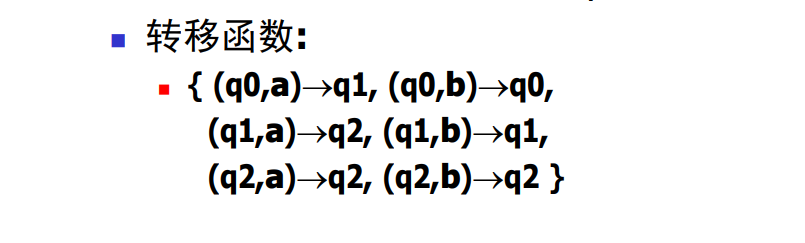

例2：
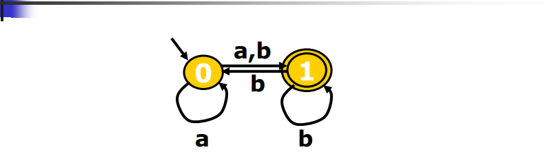
- 转移函数：
    {(q0,a) -> {q0,q1},
     (q0,b) -> {q1},
     (q1,b) -> {q0,q1}}
  
这种转移结果不确定的状态机叫非确定状态机NFA，确定状态机DFA。

在DFA状态机中，对于字符的接受较容易判断，而NFA中多种转移结果，需要遍历和回溯的操作。

2.小结
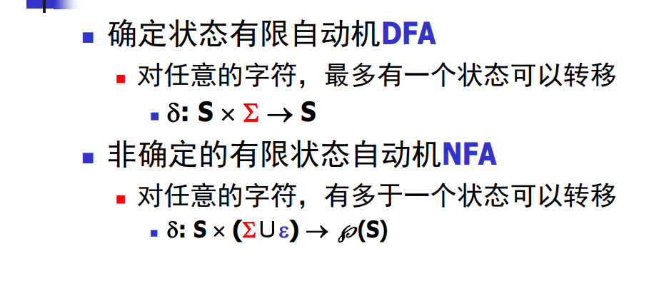

### 五、正则表达式到NFA

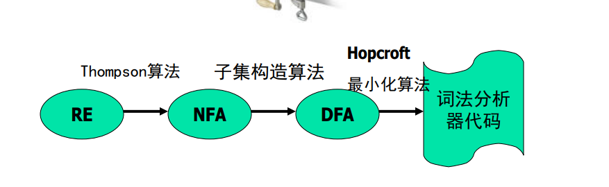

Thompson算法（数学归纳思想）：对基本的RE直接构造，对复合的RE递归构造

例1：
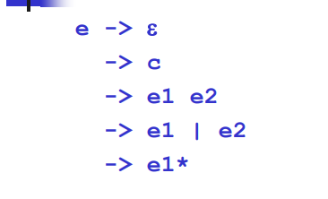

对前两种直接构造：
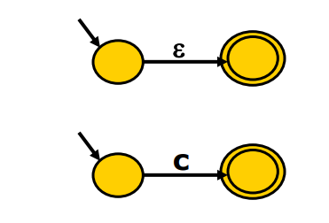

对第三种递归构造：
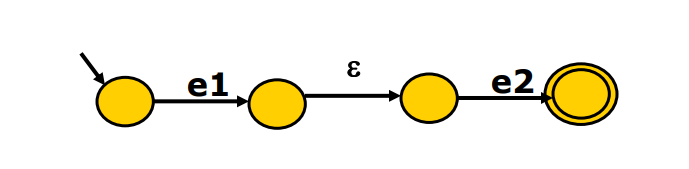
注：空串形式在图的表达和节点融合等操作时更加方便。

第四种构造：
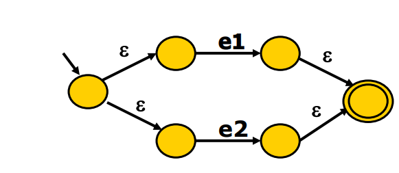

第五种构造：
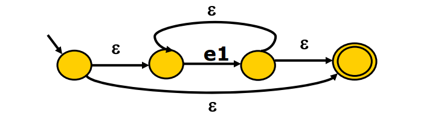

例2：
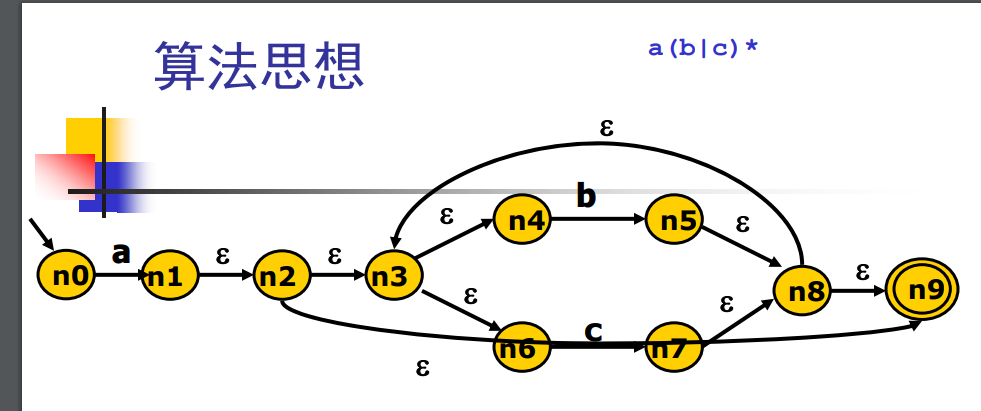

### 六、NFA到DFA

1.子集构造算法：需要构造与NFA效果完全相同的DFA

````
   a
n0 --> n1
由于空串边，可以继续转移       
n0 --> {n1,n2,n3,n4,n6,n9}记为q1

   b
q1 --> {n5,n8,n9,n3,n4,n6}记为q2
````
以上，可以得到所有节点状态的并集。这个得到并集状态算法称为不动点算法

子集构造算法实现
````
q0 <- eps_closure (n0)//从初始状态出发，经过所有e边可以得到的子集
Q <- {q0}
workList <- q0//加入队列，会对队列遍历
while (workList != [])
    remove q from workList//处理后移除
    foreach (character c)//对所有字符遍历
        t <- e-closure (delta (q, c))//delta函数就是对字符c进行状态转移后可以到达的节点，并做e处理
        D[q, c] <- t//子集加入DFA集合中
        if (t\not\in Q)
            add t to Q and workList//对于新的未出现过的状态加入队列，进行下一次的状态转移
````
最终可以得到DFA的子集。


实现过程
````
q0 = {n0} 
delta(q0, "a") ->
q1 = t = {n1,n2,n3,n4,n6,n0}

第二轮foreach，这时只能接受两个值b，c
b:q2 = {n5,n8,n9,n3,n4,n6} workList=[q2]
c:q3 = {n7,n8,n9,n3,n4,n6} workList=[q2,q3]

第三轮foreach，也只接受b，c
出现闭包自循环，同时队列中也会移除q2,q3
````
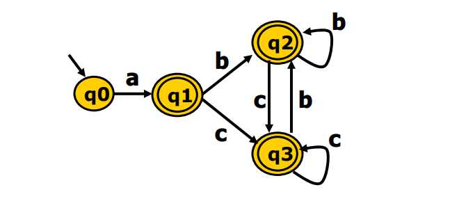

算法必然会终止，且它的时间复杂度时O(2^n)，但实际中并不常见最坏情况，因为并不是每个子集都会出现。

对于e闭包可以基于深度有限和广度优先实现
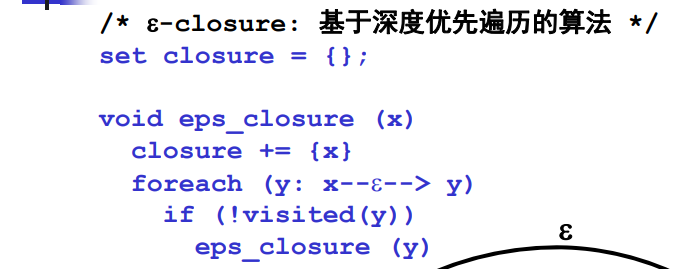
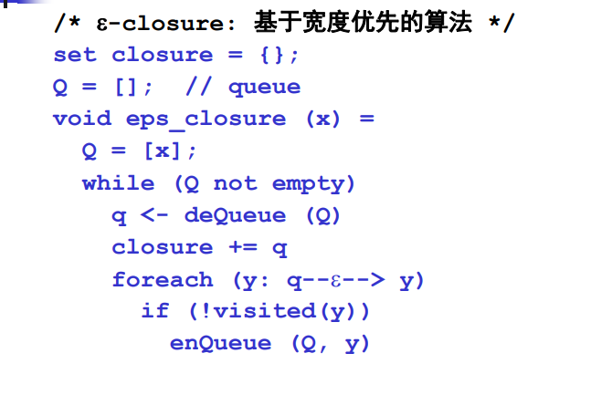

