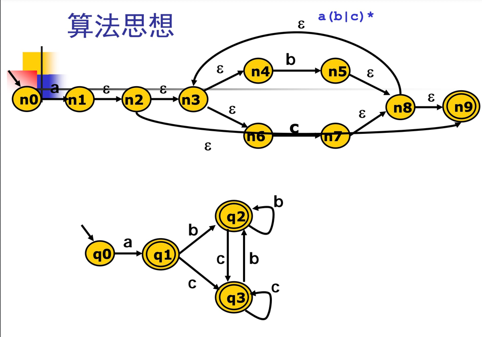
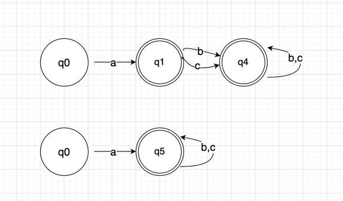
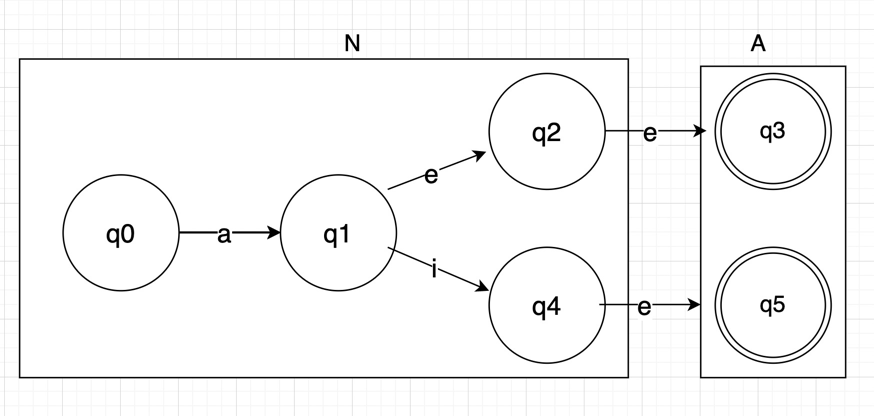
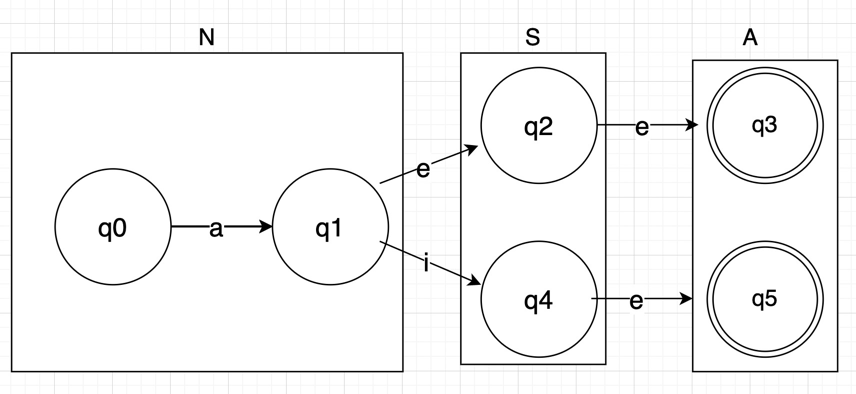
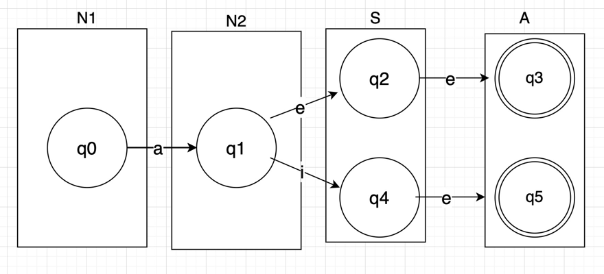
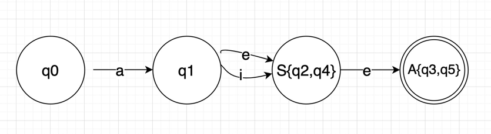
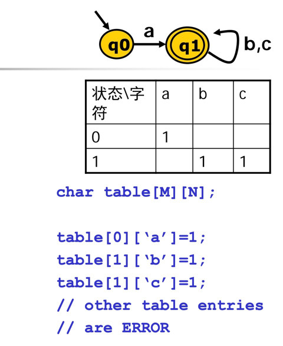
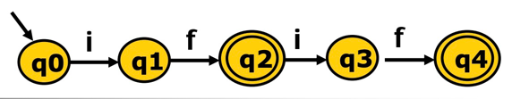

#### 3.3DFA最小化

Hopcroft最小化算法



上图DFA可以进行合并化简

状态和边少，运算速度越快

Hopcroft算法
````
//等价类算法
split(S)
    foreach (character c)
        if (c can split S)//对某个字符的状态转移可以进入到n个等价类，那么就被切分成n个子集，递归对所有子集切分直到不可再分
            split S into T1, …, Tk

hopcroft ()
    split all nodes into N, A
    while (set is still changes)
        split(S)//算法起点，第一次切分为两个，接受状态和非接受状态
````

例1：


第一次切分，接受状态和非接受状态


第二次切分，按接受e字符后可以转移到哪个子集

N子集接受e，可以进入N，也可以进入S，切分为N1，N2

最终状态


DFA合并图


### 四、DFA代码表示

从概念上看，DFA是一个有向图。
- 转移表
- 哈希表
- 跳转表

1.转移表

a (b | c)*构建DFA和表


驱动代码
````
nextToken()
    state = 0//状态值
    stack = []
    while (state!=ERROR)
        c = getChar()//读一个输入
        if (state is ACCEPT)//是否为接受状态
            clear(stack)
            
        push(state)
        state = table[state][c]
    
    while(state is not ACCEPT)
        state = pop();
        rollback();
````
````
如abcabc

state = 0, stack = []

c = a, stack = [0], state = 1
c = b, stack clear, stack = [1], state = 1
c = c, stack clear, stack = [1], state = 1

c = a, stack clear, stack = [1], state = error

stack pop, state = 1, rollback()回滚指针
最终成功识别出abc作为一个token符号，再一次识别时从第二个a开始
````

2.最长匹配


当读入ifif时，最终会到状态4，成功被识别。

到读入ifi时，到了状态3后会state=error，进入回滚，最终回滚到状态2，识别出if。

可以看出识别时首先尝试匹配最长的字符，并压入栈记录匹配过程中的状态，当错误时，就可以弹出栈进行状态的回滚。

3.跳转实现
```
nextToken()
    state = 0
    stack = []
    goto q0
    
q0:
    c = getChar()
    if (state is ACCEPT)
        clear (stack)
    push (state)
    
    if (c==‘a’)
        goto q1
    
q1:
    c = getChar()
    if (state is ACCEPT)
        clear (stack)
    push (state)
    
    if (c==‘b’||c==‘c’)
        goto q1
```
通过对每个状态的编码显式实现goto跳转（就是转移表中的格子），这种方式就不需要维护可能很大的转移表。


词法分析：

- 手动构造
- 自动构造：RE -> NFA -> DFA -> 驱动代码

输入流通过驱动代码的处理不断识别出一个个token，形成一个符号流。


