### 一、概述
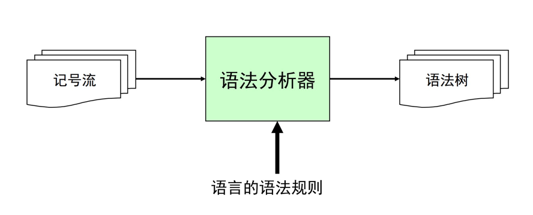

对给定的记号流根据语法分析器转化为抽象语法树，同时也对合法性做校验

1.错误校验功能

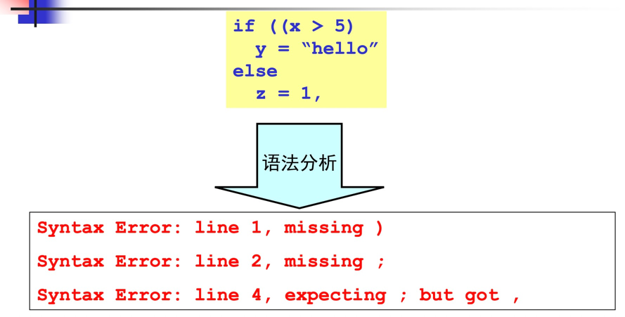

2.语法树构建

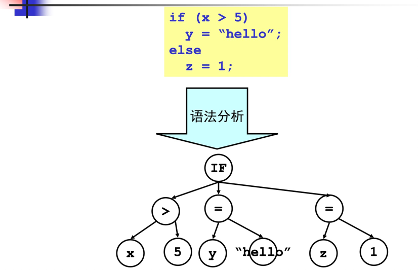

### 二、上下文无关文法

1.Chomsky文法分类体系

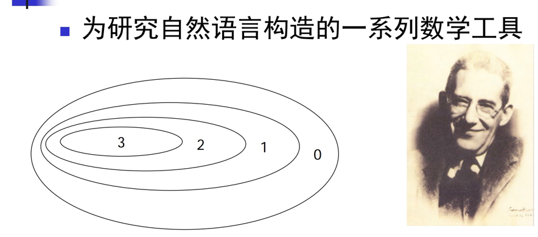

- 3型文法：正则文法（词法分析）
- 2型文法：上下文无关文法（语法分析）
- 1型文法：上下文有关文法
- 0型文法：无限制文法

自然语言语法
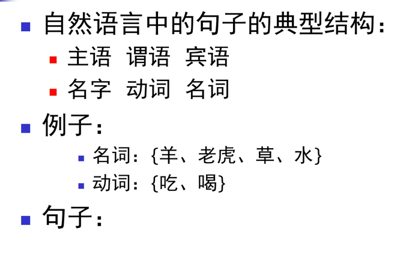

形式化
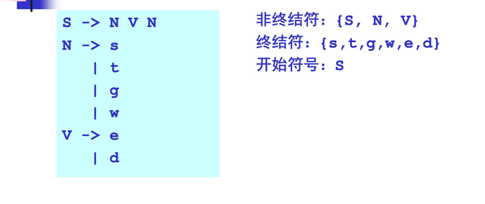

S表示一个句子和合法形式。

非终结符表示句子的中间形式。当句子中所有的符号都是终结符时，不可以再下推，那么就是最终形式。

2.上下文无关文法定义
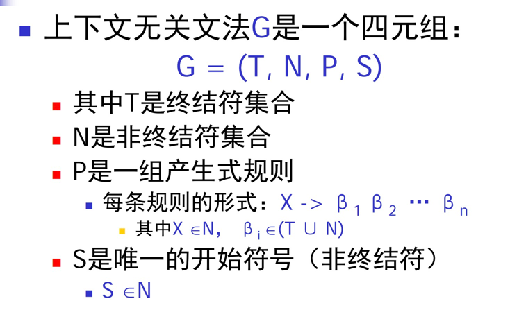

例：
````
G = {N T F S}
非终结符N = {S, N, V}
终结符T = {s,t,g,w,e,d}
开始符号S
产生式规则P 
    S -> N V N
    N -> s
        | t
        | g
        | w
    V -> e
        | d
````

3.推导

- 给定文法G，从G的开始符号S开始，用产生式
  的右部替换左侧的非终结符
- 此过程不断重复，直到不出现非终结符为止
- 最终的串称为句子

最左推导：每次总是选择最左侧的符号进行替换，最右推导同理。

语法分析器用作是：给定上下文无关文法G和句子s，语法分析要回答的问题：是否存在对句子s的推导？YES OR NO，如果不存在具体是哪里给出的错。

4.分析树

将推导表达为树结构（和推导所用的顺序无关（最左、最右、其他））

- 树中的每个内部节点代表非终结符
- 每个叶子节点代表终结符
- 每一步推导代表如何从双亲节点生成它的直接孩子节点

例：
````
E -> num
  | id
  | E + E
  | E * E
  
一般推导
E -> E + E
  -> 3 + E
  -> 3 + E * E
  -> 3 + 4 * E
  -> 3 + 4 * 5
  
E -> E * E
  -> E + E * E
  -> 3 + E * E
  -> 3 + 4 * E
  -> 3 + 4 * 5
````
分析树推导
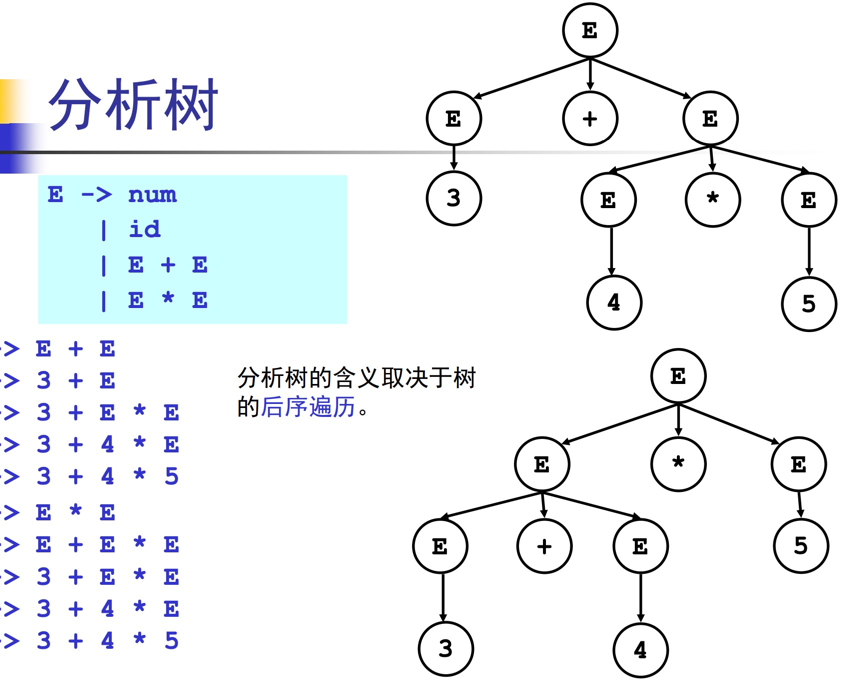

5.二义性文法

给定文法G，如果存在句子s，它有两棵不同的分析树，那么称G是二义性文法。

从编译器角度，二义性文法存在问题：
- 同一个程序会有不同的含义
- 因此程序运行的结果不是唯一的

解决方案：文法的重写

### 二、自顶向下算法思路

语法分析：给定文法G和句子s，回答s是否能够从G推导出来？

基本算法思想：从G的开始符号出发，随意推导出某个句子t，比较t和s
- 若t==s，则yes。
- 若t!=s，可能要经过一系列的回溯比较后才能给出结论。

由于这是从开始符号出发推出句子，因此称为自顶向下分析，对应于分析树自顶向下的构造顺序。

算法：
````
tokens[]; //词法分析器给出的记号流
i=0;//token数组指针
stack = [S] //所有的终结符和非终结符序列，最开始只有S，S是开始符号

while (stack != [])
  if (stack[top] is a terminal t)//是否是一个终结符
    if (t==tokens[i++])//判断该终结符和记号流中当前位置元素是否相同
      pop();//匹配成功，弹出该符号，进入下一次比较
    else backtrack();//匹配失败，回溯
  else if (stack[top] is a nonterminal T)//非终结符
    pop();//弹出终结符
    push(the next right hand side of T)//并且逆序压入(下一次)终结符右侧的表达式，栈模拟后序遍历
````

例：
````
S -> N V N
N -> s
  | t
  | g
  | w
V -> e
  | d
  
从这个文法推导g d w

tokens = [g d w]
i = 0, stack = [S]

pop(), stack = [], push(), stack = [N,V,N]
pop(), stack = [N,V], push(), stack = [N,V,s]

s != g 回溯, stack = [N,V,N], i = 0
pop(), stack = [N,V], push(), stack = [N,V,t]
......
````

这个算法需要回溯，在上千万行代码编译中比较低效，需要线性时间算法，引出递归下降分析算法和LL(1)分析算法。

用前看算法避免回溯：

即在选择下一个表达式时，并不按顺序遍历和回溯，而是有目标地去选择表达式，即从已给出的句子指导去选择表达式。

问题：
````
如表达式为
N -> s
  | t
  | g
  | w
  | tg

当句子为t时，是选择t去匹配还是tg？如何解决冲突
````

### 三、自顶向下算法思路-递归下降分析算法

也称为预测分析（手动生成语法分析器）
- 分析高效（线性时间）
- 容易实现（方便手工编码）
- 错误定位和诊断信息准确
- 被很多开源和商业的编译器所采用GCC 4.0， LLVM，。。。

算法基本思想：
- 每个非终结符构造一个分析函数
- 用前看符号指导产生式规则的选择

算法一般框架：
````
X ->β11…β1i
  |β21…β2j
  |β31…β3k
  |…

parse_X()
  token = nextToken()
  switch(token)
  case …: //β11…β1i
  case …: //β21…β2j
  case …: //β31…β3k
  …
  default: error (“…”);
````

具体文法算法
````
S -> N V N
N -> s
  | t
  | g
  | w
V -> e
  | d
  
从这个文法推导g d w
分治法思想，分别处理SNV

parse_S()//非终结符组成，递归调用
  parse_N()
  parse_V()
  parse_N()
  
parse_N()//终结符组成，直接比较
  token = tokens[i++]
  if (token==s||token==t||token==g||token==w)//token和表达式所有可能比较
    return;
  error(“…”);//给出具体错误

parse_V()
  token = tokens[i++]
  …// leave this part to you
````

例：
````
E -> E + T
  | T
  
T -> T * F
  | F
  
F -> num

分析3+4*5

parse_E()
token = tokens[i++]

if (token==num)
  ? //由于E的表达式E+T或T都可以接受num，出现多种可能 parse_E + parse_T OR parse_T
  else error(“…”);
  
可以通过分析代码手动解决
parse_E()
  parse_T()
  token = tokens[i++]
  while (token == +)
    parse_T()
    token = tokens[i++]

parse_T()
  parse_F()
  token = tokens[i++]
  while (token == *)
    parse_F()
    token = tokens[i++]
````

### 四、自顶向下算法思路-LL(1)算法（通过声明自动生成语法分析器的算法）

从左（L）向右读入程序，最左（L）推导，采用一个（1）前看符号
- 分析高效（线性时间）
- 错误定位和诊断信息准确
- 有很多开源或商业的生成

算法基本思想：
- 表驱动的分析算法

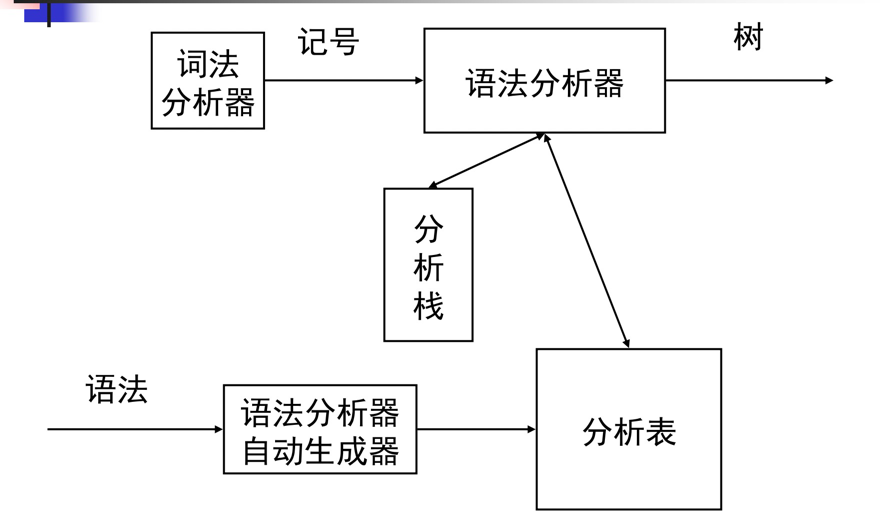

在自顶向下的算法中，选择next表达式时并不保证正确，所以需要回溯，需要某个可以得到正确correct的表达式的算法。

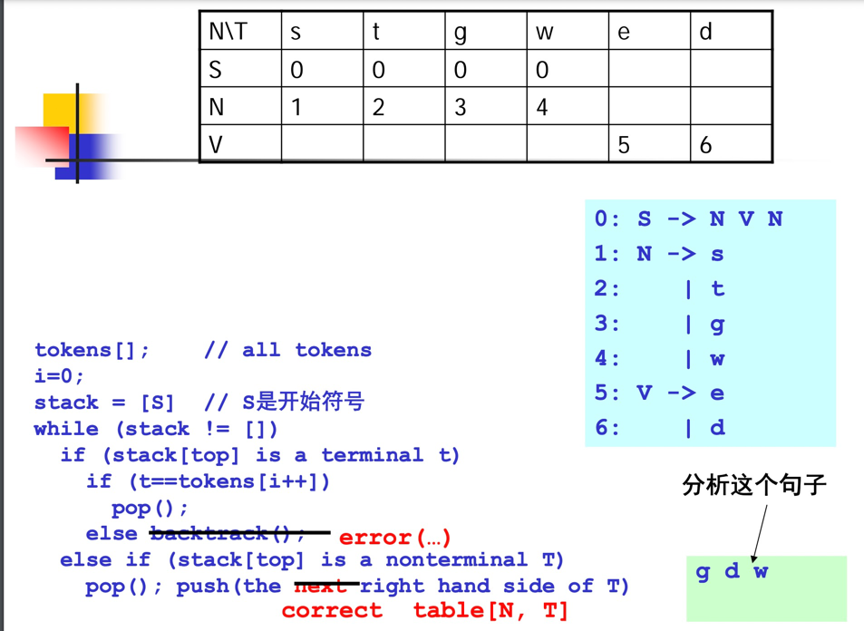

````
tokens[]; // all tokens
i=0;
stack = [S] // S是开始符号
while (stack != [])
  if (stack[top] is a terminal t)
    if (t==tokens[i++])
      pop();
  else error;
  
  else if (stack[top] is a nonterminalT)
    pop(); 
    push(the correct right hand side of T)//来自表 table[N,T]

i = 0, stack = [S]
pop() stack = [], push(table[N,T])//此时N为S，T为g，压入第0行 stack = [N,V,N]
pop() stack = [N,V,N], push(table[N,g]), stack = [N,V,g]
````

1.简单形式FIRST集

定义：
FIRST(N) = 从非终结符N开始推导得出的句子开头的所有可能终结符集合

如S的推导就是{s,t,g,w}
````
若N -> a
  FIRST(N) U= a
 
若N -> M
  FIRST(N) U= FIRST(M)
  
不动点算法

foreach (nonterminal N)
  FIRST(N) = {}//初始为空
  
while(some set is changing)//有在变化的集合
  foreach (production p: N->β1 … βn)//对每个非终结符计算
    if (β1== a …)
      FIRST(N) ∪= {a}
    if (β1== M …)
      FIRST(N) ∪= FIRST(M)
````

例：
````
0: S -> N V N
1: N -> s
2: | t
3: | g
4: | w
5: V -> e
6: | d

第0轮：S = {}, N = {}, V = {}

第1轮：
  S -> N V N，那么并入N集，N为null，S = {}
  N = {s,t,g,w}
  V = {e,d}
  
第2轮：
  NV发生变化，继续循环
  S -> N V N，那么并入N集，N = {s,t,g,w}，s = {s,t,g,w}
  N = {s,t,g,w}
  V = {e,d}
 
第3轮：
  S发生变化，继续循环
  S = {s,t,g,w}
  N = {s,t,g,w}
  V = {e,d}

无变化，终止，FIRST构造成功
````
从FIRST集即可推出LL1分析表
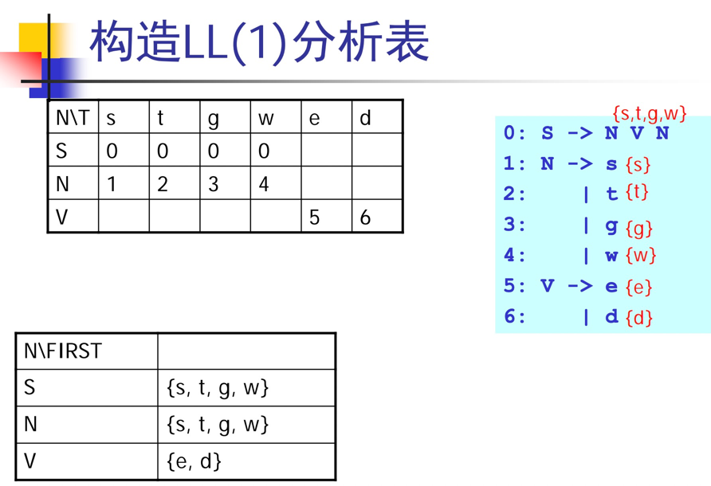

LL1分析表冲突
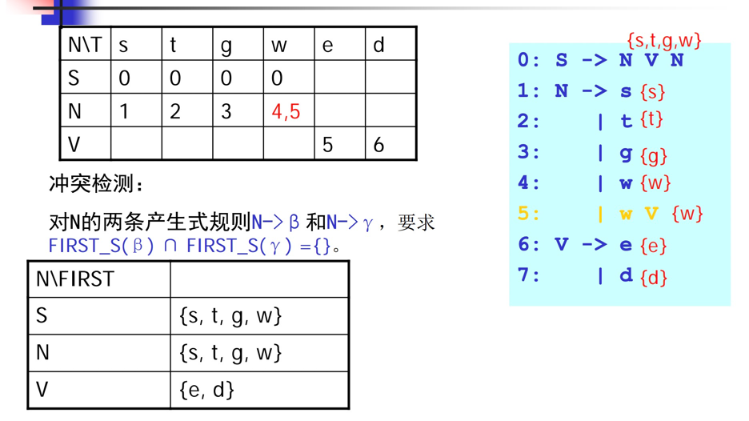

一般形式下的LL1构造
```
Z -> d
  | X Y Z
Y -> c
  |
X -> Y
  | a
```
- 如果产生式(Z-> X Y Z)中存在空串，那么需要继续向后推下一个非终结符
- 对于NULLABLE的集的讨论
- 如何知道下一个非终结符？跟随集FOLLOW

2.NULLABLE集合

定义：
- X ->
- X -> Y1 … Yn （Y1 … Yn是 n个非终结符，且都属于NULLABLE集）

NULLBALE算法
````math
NULLABLE = {};
while (NULLABLE is still changing)
  foreach (production p: X->β)
    if (β==\epsilon)
      NULLABLE ∪= {X}
    if (β== Y1 … Yn)
      if (Y1 \in NULLABLE && … && Yn \in NULLABLE)
      NULLABLE ∪= {X}
````
````
Z -> d
  | X Y Z
Y -> c
  |
X -> Y
  | a
  
null = {}
null = {Y,X}
````

3.FISRT集合完整公式

定义：
- X -> a, FIRST (X) ∪= {a}
- X -> Y1 Y2 … Yn
  - FIRST (X) ∪= FIRST(Y1)
  - if Y1 \in NULLABLE, FIRST (X) ∪= FIRST(Y2)
  - if Y1,Y2 \in NULLABLE, FIRST(X) ∪= FIRST(Y3)
  - …
  
算法
````
foreach (nonterminal N)
  FIRST(N) = {}
  
while(some set is changing)
  foreach (production p: N->β1 … βn)
    foreach (βi from β1 upto βn)
      if (βi== a …)
        FIRST(N) ∪= {a}
        break
    
      if (βi== M …)
        FIRST(N) ∪= FIRST(M)
        //如Z -> XYZ 如果X不为null，那么first找到，如果X为null，那么需要继续循环直到下一个不为null
        if (M is not in NULLABLE)
        break;   
````
````
Z -> d
  | X Y Z
Y -> c
  |
X -> Y
  | a

null = {Y,X} 
第0轮：Z = {}, Y = {}, X ={}
第1轮：
  Z = {d}, Z U X, X为null, Z U Y, Y为null, Z U Z 
  Y = {c}, X = {c,a}
第2轮：
  Z = {d,c,a} Z U X, X为null,c,a, Z U Y, Y为null,a
  Y = {c}, X = {c,a}
````

4.FOLLOW集

文法中每一个非终结符X的之后的集合FOLLOW(X)。终结符的Follow集合没有定义，只有非终结符才会有Follow集合

FOLLOW集只作用在推导式的右侧

Z -> X Y Z

算法中只计算X和Y的FOLLOW集，Z没有FOLLOW集

````

foreach (nonterminal N)
  FOLLOW(N) = {}
  
while(some set is changing)
foreach (production p: N->β1 … βn)
  temp = FOLLOW(N)//N之后可能接什么
  foreach (βi from βn downto β1) // 逆序！
    if (βi== a …)//a一定可以接在N之后
      temp = {a}
    if (βi== M …)
      //结尾是非终结符，此时temp运算位置到达M之后的follow集，那么FOLLOW(M)可以求得
      //相当于在N的计算过程中顺便合并M的FOLLOW
      FOLLOW(M) ∪= temp
      if (M is not NULLABLE)
        temp = FIRST(M)//不为空，temp只需要与M有关，为M的FIRST集
      else 
        temp ∪= FIRST(M)//为空，需要计算M之后的集，是合并关系
````
````
Z -> d
  | X Y Z
Y -> c
  |
X -> Y
  | a

null = {Y,X}
FRIST = Z = {a,c,d} X = {a,c} Y = {c}

第0轮：Z = {}, Y = {}, X = {}
第1轮：
  1.Z = {} //所有表达式中Z后面没有东西，Z没有FOLLOW集
  2.计算XYZ，逆序开始
  3.FOLLOW(Z) = {d}
  4.temp = FIRST(Z) = {a,c,d}
  5.FOLLOW(Y) U temp = {a,c,d}
  6.temp U= FIRST(Y) temp = {a,c,d}
  7.FOLLOW(X) U temp = {a,c,d}
````

6.FIRST_S集合

结合FIRST，FOLLOW，NULL得到最终一般串的算法。

FIRST指非终结符由哪些终结符开始是合法的。
FOLLOW集指当非终结符可以为空时，其后跟随哪些终结符是合法的。

````
foreach (production p)
  FIRST_S(p) = {}
  
calculte_FIRST_S(production p: N->β1 … βn)
  foreach (βi from β1 to βn)
    if (βi== a …)
      FIRST_S(p) ∪= {a}
      return;
    if (βi== M …)
      FIRST_S(p) ∪= FIRST(M)
        if (M is not NULLABLE)
          return;
        //为空进入下一次循环
          
   FIRST_S(p) ∪= FOLLOW(N)//前面全部都为空，没有return，那么追加FOLLOW集
````

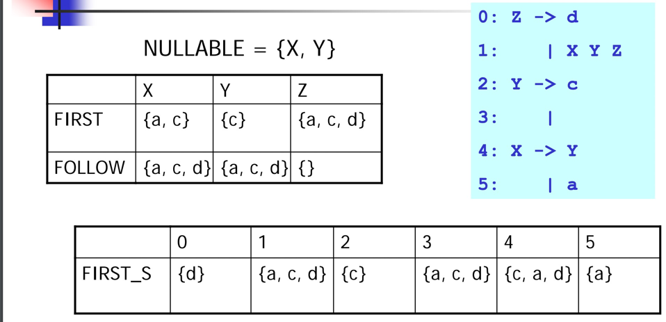

构造LL1表
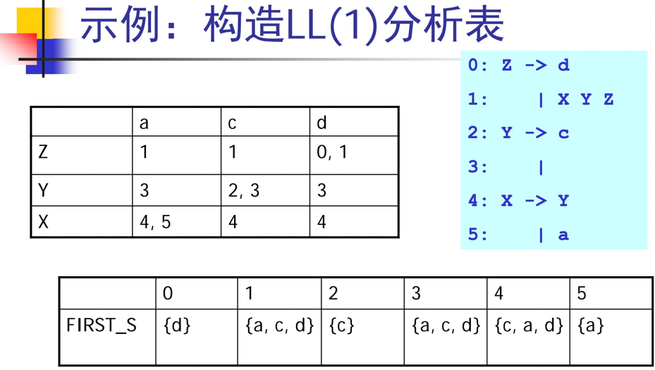

有了跳转表之后，将自顶向下分析算法用表改造
````
tokens[]; // all tokens
i=0;
stack = [S] // S是开始符号
while (stack != [])
  if (stack[top] is a terminal t)
    if (t==tokens[i++])
      pop();
    else error(…);
  else if (stack[top] is a nonterminal T)
    pop()
    push(table[T, tokens[i]])//用跳转表指导压入的元素
````

消除冲突：消除左递归，提取左公因子


