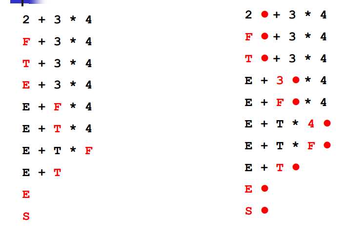
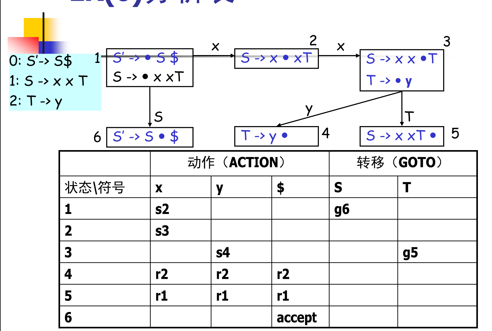
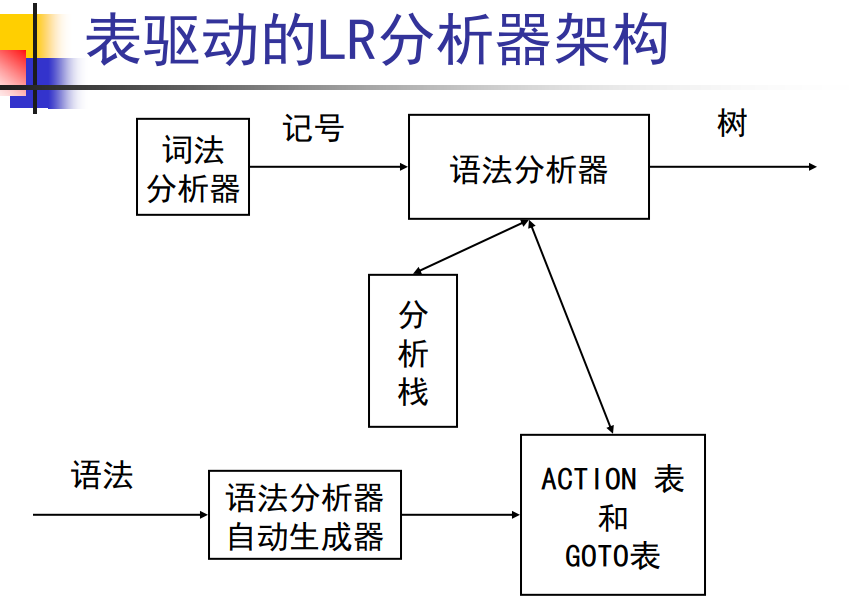
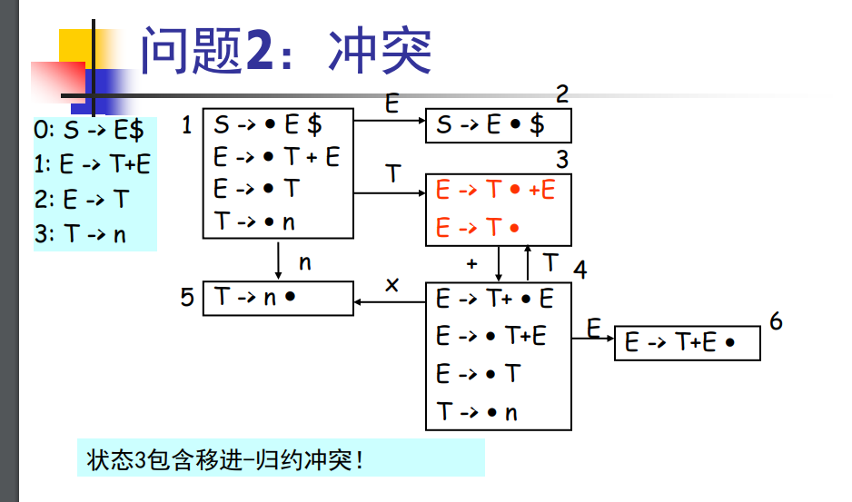
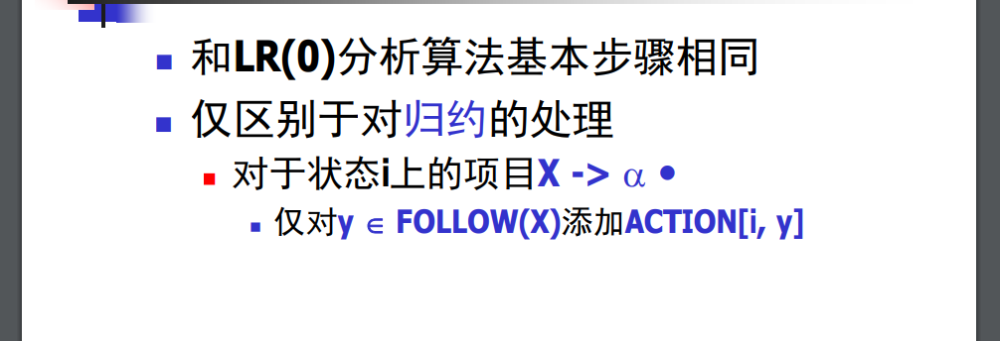
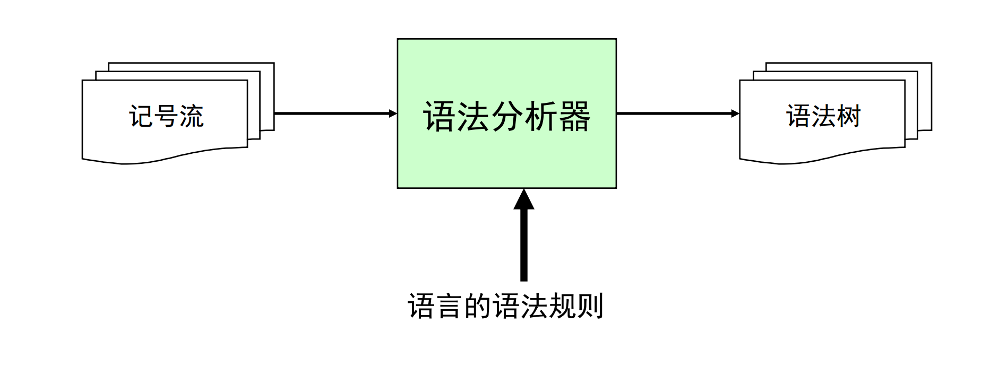

### 五、自底向上分析算法-LR0算法

LL1分析算法：从左（L）向右读入程序，最左（L）推导，采用一个（1）前看符号
- 算法运行高效
- 能分析的文法类型受限
- 往往需要文法的改写

LR0分析算法，向左推导，向左规约，0个符号
- 文法分析更高效
- 不需要更改文法


1.自底向上分析

表达式右侧向左侧称为规约。
````
0: S -> E
1: E -> E + T
2: | T
3: T -> T * F
4: | F
5: F -> n

2 + 3 * 4
F + 3 * 4
T + 3 * 4
E + 3 * 4
E + F * 4
E + T * 4
E + T * F
E + T
E
S

不停收缩，最右推导的逆过程
````

为了方便标记语法分析器已经读入了多少输入，我们可以引入一个点记号 •


栈：


最右推导的步骤
- 移进一个记号到栈顶上
- 归约栈顶上的n个符号（某产生式的右部） 到左部的非终结符
    - 对产生式 A ->1 …  n
        - 如果n …1在栈顶上，则弹出n… 1
        - 压入A
    
LR0分析表


LR0算法：
````
stack = []
push ($) // $: end of file
push (1) // 1: 初始状态
while (true)
    token t = nextToken()//输入
    state s = stack[top]//状态
    //移进逻辑，压入字符，压入状态
    if (ACTION[s, t] == “si”)//
        push (t); push (i)
    //规约逻辑，弹出规约的字符和状态，压入等价非终结符，然后根据状态和GOTO表跳转状态
    else if (ACTION[s, t] == “rj”)
        pop (the right hand of production “j: X -> ”)
        state s = stack[top]
        push (X); push (GOTO[s, X])
    else error (…)
````

分析表构造算法：
````
C0 = closure (S’ -> 。S $) // the init closure
SET = {C0} // all states
Q = enQueue(C0) // a queue

while (Q is not empty)
    C = deQueue (Q)
    foreach (x 属于 (N∪T))
        D = goto (C, x)
        if (x 属于 T)
            ACTION[C, x] = D
        else GOTO[C, x] = D
        
        if (D not 属于 SET)
            SET ∪= {D}
            enQueue (D)

goto (C, x)//goto表
    temp = {} // a set
    foreach (C’s item i: A -> βx γ)
        temp ∪= {A -> βx γ}
    return closure (temp)
    
closure (C)//闭包函数，将非终结符换成等价的终结符，可能有多个
    while(C is still changing)
        foreach (C’s item i: A -> βB γ)
            C ∪= {B -> …}
````

### 六、SLR分析算法


LR0分析算法问题：
- 延迟错误，过晚地发现错误，导致无效的运算
- 包含冲突

规约冲突



SLR分析算法

仅对follow集做规约

### 七、LR(1)分析算法

SLR中仍可能存在的冲突。

SLR只是简单地考察下一个输入符号b是否属于与归约项目A→α相关联的FOLLOW(A)，但b∈FOLLOW(A)只是归约α的一个必要条件，而非充分条件。

### 八、其他

1.文法二义性

- 二义性文法无法使用LR分析算法分析
- 不过，有几类二义性文法很容易理解， 因此，在LR分析器的生成工具中，可以对它们特殊处理
    - 优先级（乘除比加减高）
    - 结合性（左结合 右结合）
    - 悬空else

2.语法分析实现



- 手工方式  、
  -递归下降分析器
- 使用语法分析器的自动生成器
    - LL(1), LR(1)
- 两种方式在实际的编译器中都有广泛的应用
    - 自动的方式更适合快速对系统进行原型
    

自动生成技术，从声明式的规范得到语法分析器。

YACC：
- YACC 是 Yet Another Compiler-Compiler缩写
- 在1975年首先由Steve Johnson在Unix上实现
- 后来，很多工具在此基础上做了改进：
    - 例如GNU Bison
    - 并且移植到了很多其他语言上
- YACC 现在是一个标准的工具（见IEEE Posix标准P1003.2）