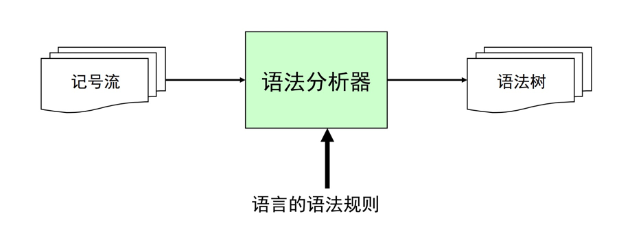
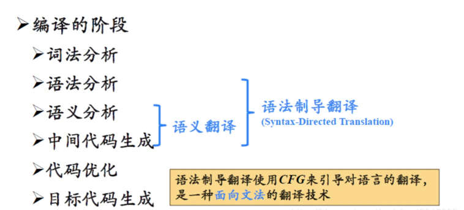
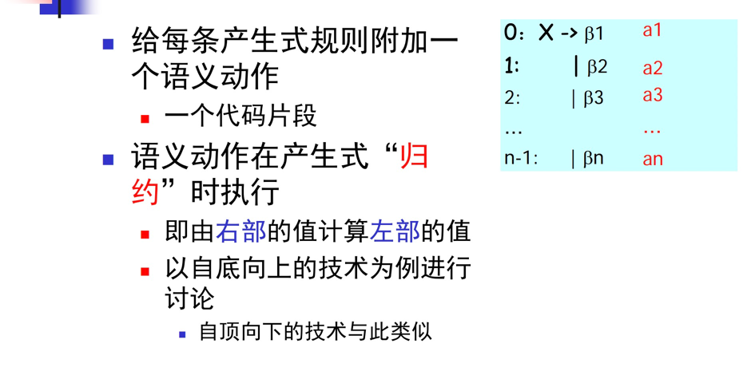
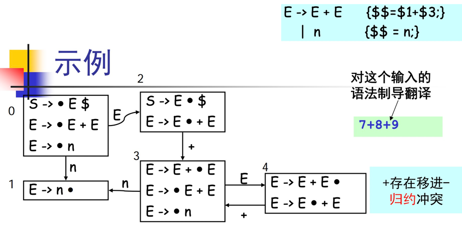
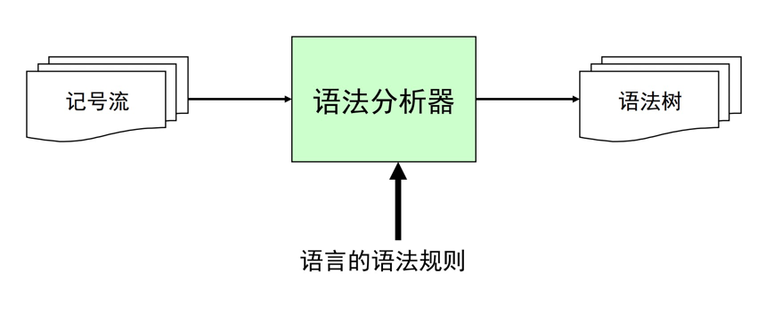
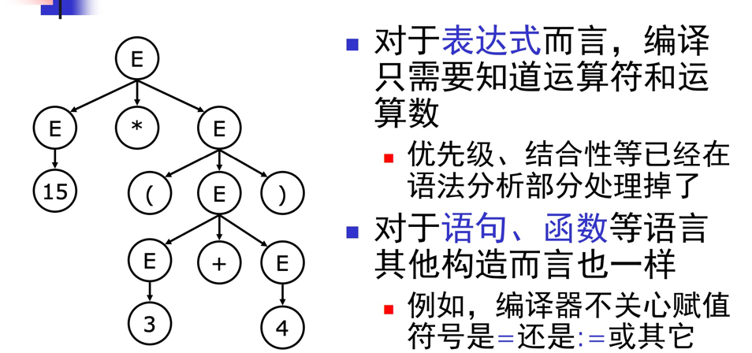
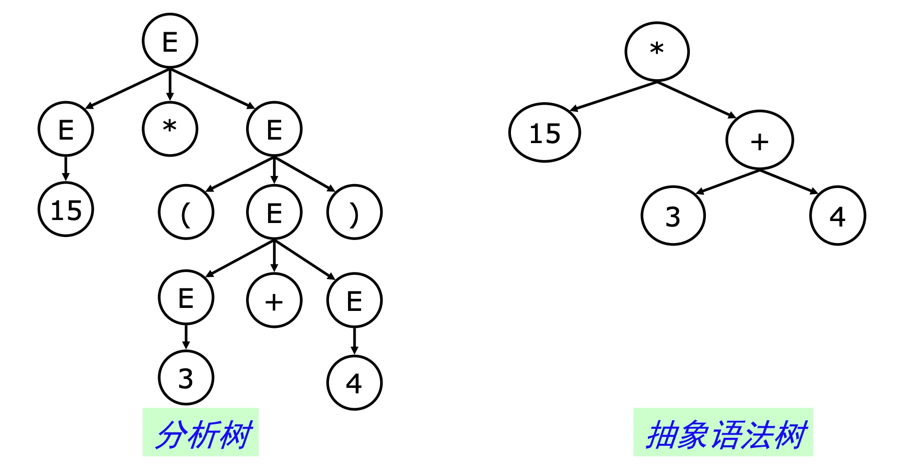
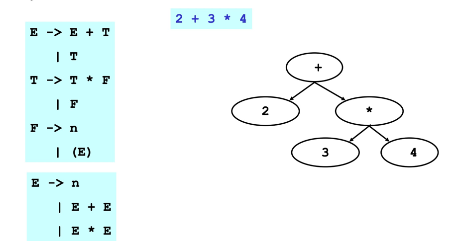
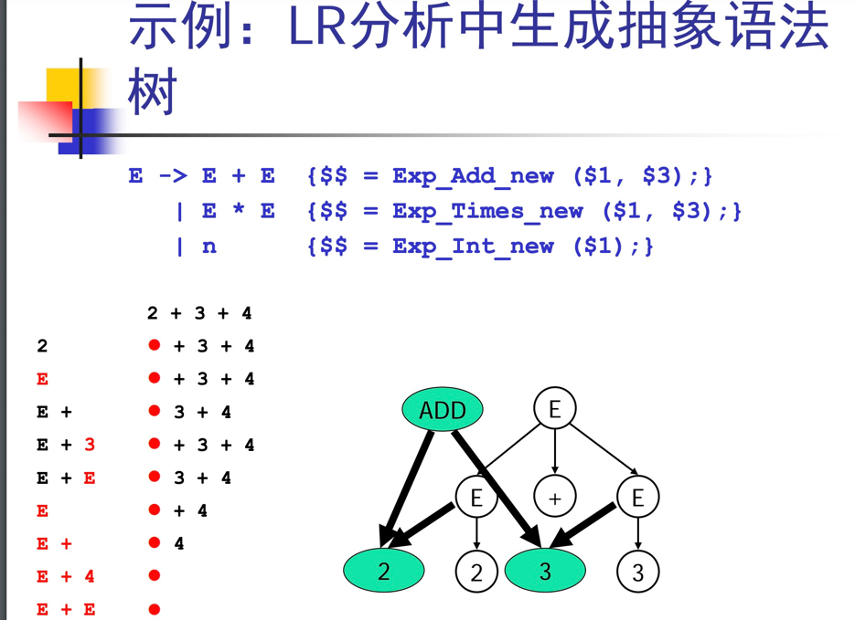

### 一、概述


- 生成语法树并验证句子合法性
- 类型检查
- 目标代码生成
- 中间代码生成

后续的工作一般可通过语法制导的翻译完成


本质上是将特定操作嵌入到语法规则中，完成语法的解析时执行特定操作。
````
//初始语法
E -> NUM + NUM

//语法制导定义
E -> NUM + { println("found op plus"); } NUM { println("value = " + ($1.value + $4.value)); }

这个例子中用花括号包围的代码就是语义动作，而其位置指定了在parse到什么地方的时候要执行该语义动作。
例如第一组语义动作位于"+"之后、第二个NUM之前，那么parse到这个"+"之后就要执行这个语义动作。
````

### 二、基本思想



````
if (action[s, t]==“ri”)
    ai//执行特定ai动作
    pop(Bi)
    state s’ = stack[top]
    push (X)
    push (goto[s’, X])
````
在分析栈上维护三元组：<symbol, value, state>
其中symbol是终结符或非终结符，value是symbol所拥有的值，state是当前的分析状态



````
<7,7,1>
<S,-,0>

<+,+,3>
<E,7,2>
<S,-,0>

<8,8,1>
<+,+,3>
<E,7,2>
<S,-,0>

<E,8,4> $3
<+,+,3>
<E,7,2> $1
<S,-,0>

<E,15,2>
<S,-,0>
...
````

### 三、抽象语法树




分析树包含很多的不必要信息，需要额外的存储空间。
- 对于表达式而言，编译只需要知道运算符和运算数。
- 优先级、结合性等已经在语法分析部分处理掉了。
- 对于语句、函数等语言其他构造而言也一样。
    - 例如，编译器不关心赋值符号是=还是:=或其它。
    


- 具体语法是语法分析器使用的语法
    - 必须适合于语法分析，如各种分隔符、消除左递归、提取左公因子，等等
    
- 抽象语法是用来表达语法结构的内部表示
    - 现代编译器一般都采用抽象语法作为前端词法语法分析）和后端（代码生成）的接口
    


- 在编译器中，为了定义抽象语法树，需要使用实现语言来定义一组数据结构
  - 和实现语言密切相关
  
- 早期的编译器有的不采用抽象语法树数据结构
  - 直接在语法制导翻译中生成代码
  - 但现代的编译器一般采用抽象语法树作为语法分析器的输出，更好的系统的支持，简化编译器的设计
  
1.数据结构
````
E -> n
  | E + E
  | E * E
  
enum kind {E_INT, E_ADD, E_TIMES};

struct Exp {
  enum kind kind;
};

struct Exp_Int{
  enum kind kind;
  int n;
};

struct Exp_Add{
  enum kind kind;
  struct Exp *left;
  struct Exp *right;
};

struct Exp_Times{
  enum kind kind;
  struct Exp *left;
  struct Exp *right;
};
````

2.构造函数
````
struct Exp_Int *Exp_Int_new (int n) {
  struct Exp_Int *p
  = malloc (sizeof(*p));
  p->kind = E_INT;
  p->n = n;
  return p;
}

struct Exp_Add *Exp_Add_new(struct Exp *left, struct Exp *right){
  struct Exp_Add *p = malloc (sizeof(*p));
  p->kind = E_ADD;
  p->left = left; p->right = right;
  return p;
}
````

例：“2+3*4” 
````
e1 = Exp_Int_new (2);
e2 = Exp_Int_new (3);
e3 = Exp_Int_new (4);
e4 = Exp_Times_new (e2, e3);
e5 = Exp_Add_new (e1, e4);
````

从LR分析变为抽象语法树


- 抽象语法树是编译器前端和后端的接口
  - 程序一旦被转换成抽象语法树，则源代码即被丢弃
  - 后续的阶段只处理抽象语法树
  
- 所以抽象语法树必须编码足够多的源代码信息
  - 例如，它必须编码每个语法结构在源代码中的位置，这样，后续的检查阶段才能精确的报错或者获取程序的执行刨面。


