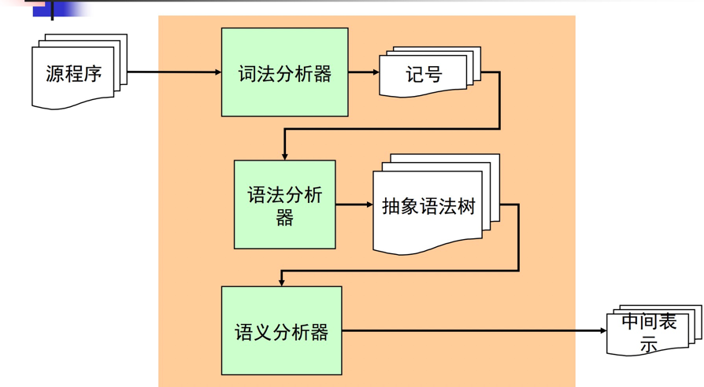
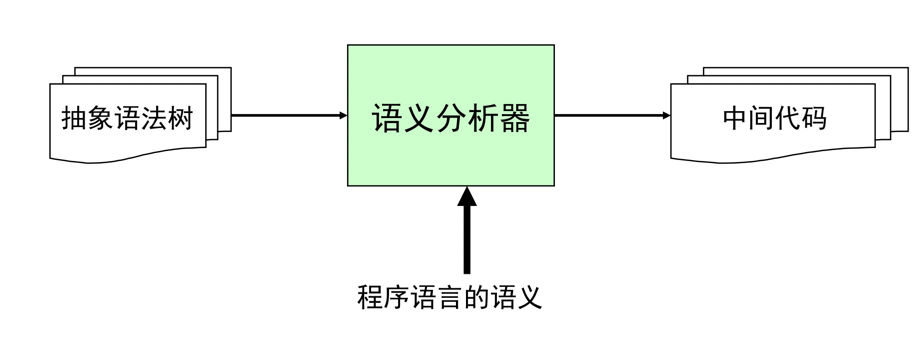
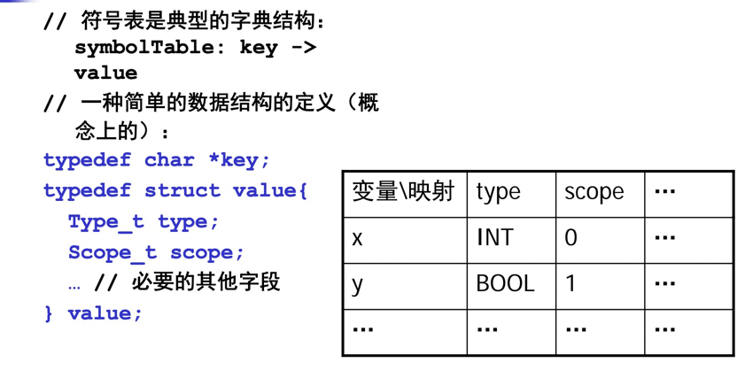

### 一、概述



语义分析
- 语义分析也称为类型检查 、上下文相关分析  
- 负责检查程序（抽象语法树）的上下文相关的属性如：
    - 变量在使用前先进行声明 
    - 每个表达式都有合适的类型
    - 函数调用和函数的定义一致
    
例：
````
//没有语法错误，但有语义错误 
//上下文检查，上下文相关分析

void f (int *p) {
  x += 4;//没有声明x？
  p (23);//没有函数p？
  “hello” + “world”;//+重载错误，无法用于字符串？
}

int main () {
  f () + 5;//参数错误？返回值无法与5相加？
  break;
  return;//返回值错误？
}
````

语义分析器结构



- 传统上，大部分的程序设计语言都采用自然语言来表达程序语言的语义
  - 例如，对于“+” 运算：要求左右操作数都必须是整型数

- 编译器的实现者必须对语言中的语义规定有全面的理解

### 二、语义检查

1.类型检查
````
C--语言

E -> n
  | true
  | false
  | E + E
  | E && E

类型合法的程序：
3+4
false && true

类型不合法的程序：
3 + true
true + false
````
语义分析的任务是：对给定的一个表达式e，写一个函数type check(e);

返回表达式e的类型；若类型不合法，则报错。

类型检查算法
````
enum type {INT, BOOL};
//不断递归调用
enum type check_exp (Exp_t e)
  switch(e->kind)
    case EXP_INT: return INT;
    case EXP_TRUE: return BOOL;
    case EXP_FALSE: return BOOL;
    case EXP_ADD: t1 = check_exp (e->left);
                  t2 = check_exp (e->right);
                  if (t1!=INT || t2!=INT)
                    error (“type mismatch”);
                  else return INT;
    case EXP_AND: … 
````

2.变量声明

````
P -> D E
D -> T id; D
  |
T -> int
  | bool
E -> n
  | id
  | true
  | false
  | E + E
  | E && E

类型合法的程序:
int x;
x+4

类型不合法的程序：
x + 3

int x;
x + false
````
算法：
````
enum type {INT, BOOL};
Table_t table;

enum type check_prog (Dec_t d, Exp_t e)
  table = check_dec (d)
  return check_exp (e)
  
Table_t check_dec (Dec_t d)
  foreach (T id d)
    table_enter (table, id, T)

enum type check_exp (Exp_t e)
  switch (e->kind)
    case EXP_ID:
      t = Table_lookup (table, id)
      if (id not exist)
        error (“id not found”)
      else return t
    
int x, boolean y;
4 + x;

对xy构建table，最后得到x -> int, y -> boolean

从table中得到xy的类型，如果没有定义，可以直接抛出错误
````

3.语句处理算法
````
void check_stm (Table_t table, Stm_t s)
  switch(s->kind)
    case STM_ASSIGN:
      t1 = Table_lookup (s->id)
      t2 = check_exp (table, s->exp)
      if (t1!=t2)
        error(“type mismatch”)
      else return INT;
      
    case STM_PRINTI:
      t = check_exp(s->exp)
      if (t!=INT)
        error (“type mismatch”)
      else return;
      
    case STM_PRINTB: …
````

### 三、符号表

- 用来存储程序中的变量相关信息，如：类型，作用域，访问控制信息
- 必须非常高效

1.数据结构



高效实现：
- 为了高效，可以使用哈希表等数据结构来实现符号表，O(1)查找效率
- 为了节约空间，也可以使用红黑树等平衡树，是O(lg N)查找效率

2.作用域问题
````
int x;
int f () {
  if (4) {
    int x;
    x = 6;
  } else {
    int x;
    x = 5;
  }
  x = 8;
 } 
````

- 一张表实现：进入作用域时，插入元素，退出作用域时，删除元素

- 采用符号表构成的栈：进入作用域时，插入新的符号表，退出作用域时，删除栈顶符号表

3.命名空间

- 每个名字空间用一个表来处理
- 如C语言：有不同的名字空间:变量，标签，标号。。。 也可以每类定义一张符号表

### 四、其他问题

1.类型相容性

- 类型检查问题题往往归结为判断两个类型是否相等t1==t2?
  - 题往往归结为判断两个类型是否相等t1==t2?
  - 对采用结构相等的语言，需要递归比较各个域
  - 在面向对象语言中还要考虑继承问题

2.错误诊断

- 要给出尽可能准确的错误信息
- 要给出尽可能多的错误信息，从错误中进行恢复
- 要给出尽可能准确的出错位置，程序代码的位置信息要从前端保留并传递过
来

3.代码翻译问题

- 现代的编译器中的语义分析模块，除了做语义分析外，还要负责生成中间代码或目标代码
  - 代码生成的过程也同样是对树的某种遍历
  
- 因此，语义分析模块往往是编译器中最庞大也最复杂的模块


