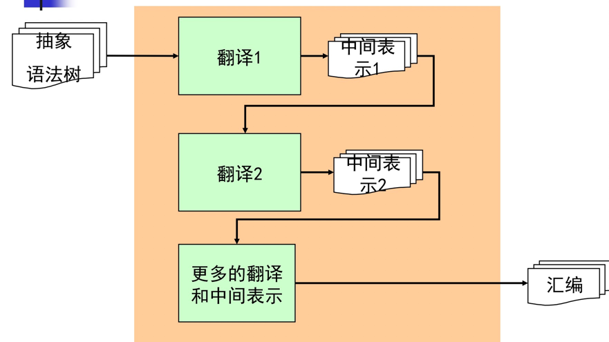
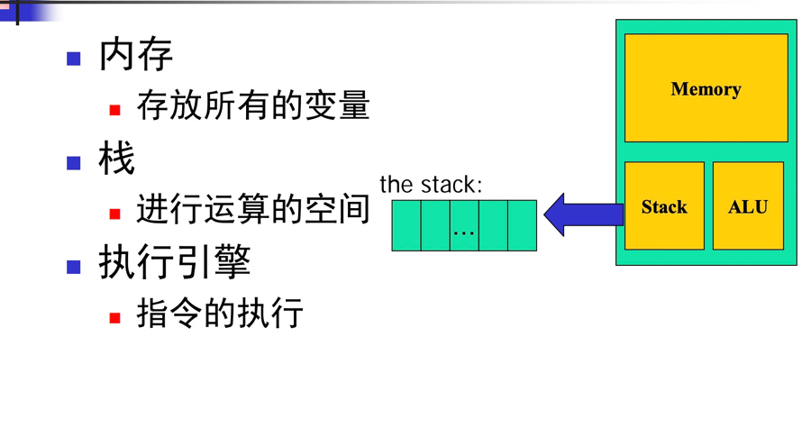
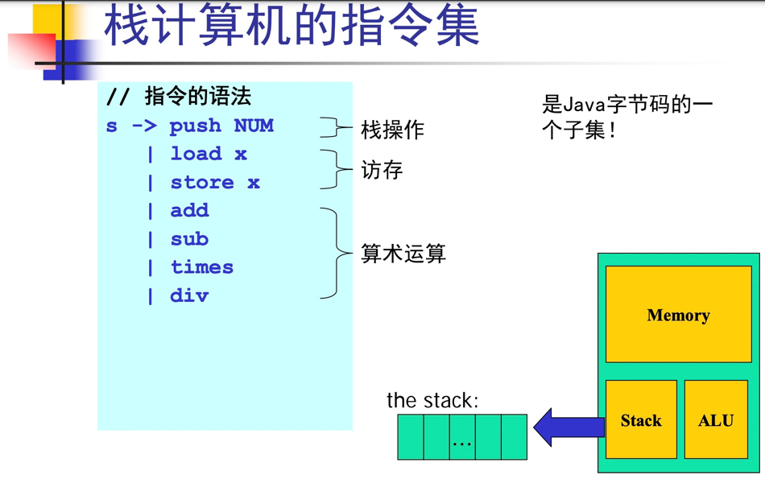
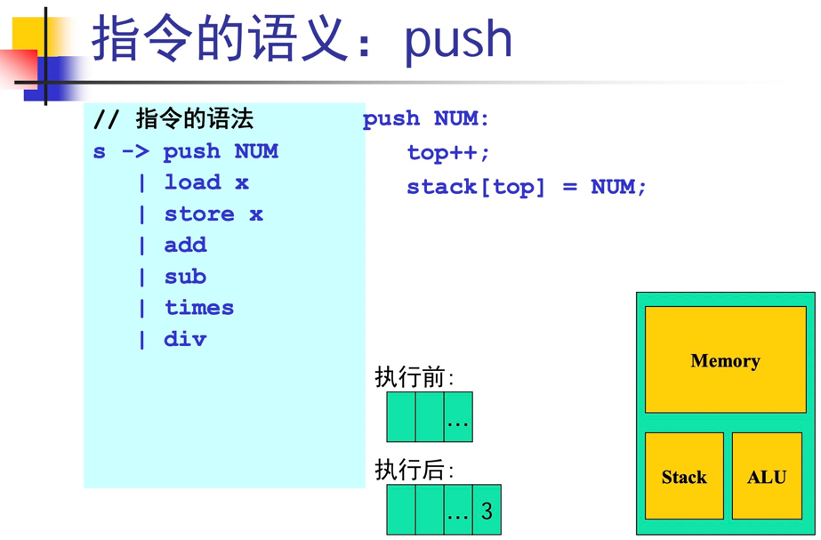
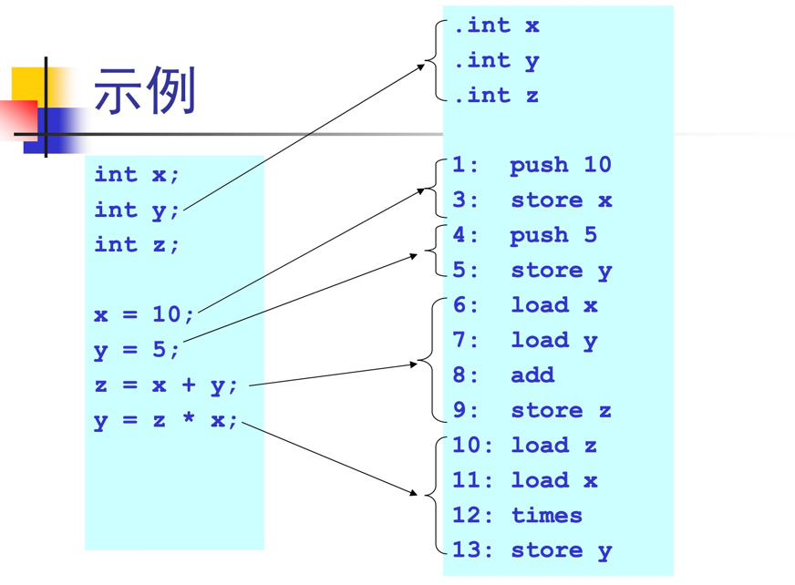
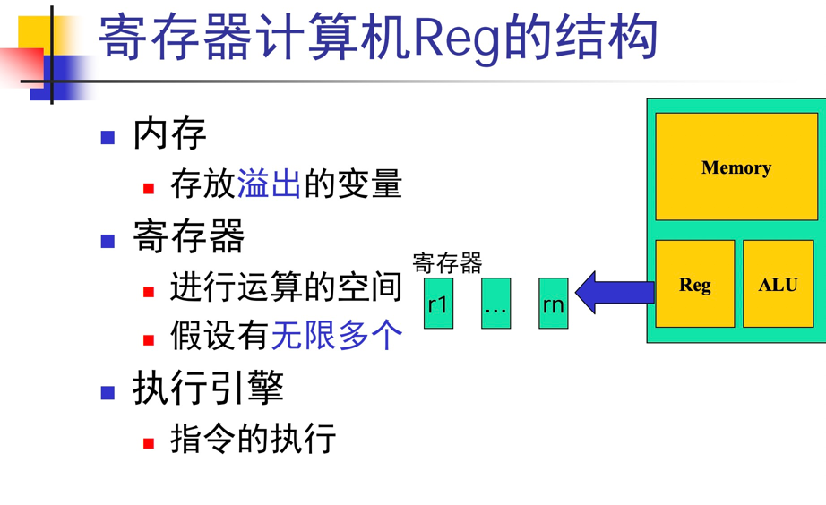
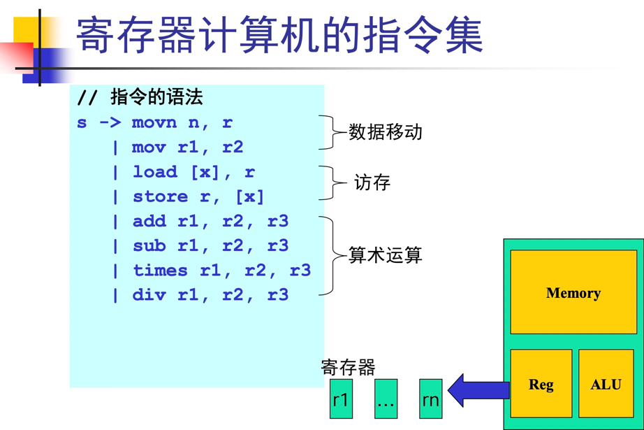

### 一、概述


不断降低抽象层次，向汇编靠近。

代码生成（保证等价性）：
- 负责把源程序翻译成“目标机器”上的代码，目标机器可以是真实物理机或虚拟机
- 给源程序的数据分配计算资源，给源程序的代码选择指令

给数据分配计算资源
- 源程序的数据：全局变量、局部变量、动态分配等
- 机器计算资源：寄存器、数据区、代码区、栈区、堆区
- 根据程序的特点和编译器的设计目标，合理的为数据分配计算资源

给代码选择合适的机器指令
- 源程序的代码：表达式运算、语句、函数等
- 机器指令：算术运算、比较、跳转、函数调用返回
- 用机器指令实现高层代码的语义

### 二、栈计算机代码生成

栈式计算机在历史上非常流行上世纪70年代曾有很多栈式计算机，但今天已经基本上已经退出了历史舞台。效率问题？

但是还是使用栈式计算机的代码生成技术的原因是：
- 给栈式计算机生成代码是最容易的
- 仍然有许多栈式的虚拟机




如PUSH指令
 

变量的内存分配伪指令：

- Stack机器只支持一种数据类型int，并且给变量x分配内存的伪指令是：.int x
- Stack机器在装载一个程序时，就会读取伪指令，并且给相关变量分配内存空间


            
递归下降代码生成算法：
````
P -> D S
D -> T id; D
     |
T -> int
     | bool
S -> id = E
     | printi (E)
     | printb (E)
E -> n
     | id
     | true
     | false
     | E + E
     | E && E
 
需要对每个表示式写代码生成函数
Gen_P(D S);
Gen_D(T id; D);
Gen_T(T);
Gen_S(S);
Gen_E(E);
````

1.表达式算法
````
//不变式：表达式的值总在栈顶
Gen_E(E e)
switch (e)
    case n: emit (“push n”); break;
    case id: emit (“load id”); break;
    case true: emit (“push 1”); break;
    case false: emit (“push 0”); break;
    case e1+e2: Gen_E (e1);
                Gen_E (e2);
                emit (“add”);
                break;
    case …: … // similar
````

2.语句生成算法
````
// 不变式：栈的规模不变
Gen_S(S s)
    switch (s)
        case id=e: Gen_E(e);
            emit(“store id”);
            break;
        case printi(e): Gen_E(e);
            emit (“printi”);
            break;
        case printb(e): Gen_E(e);
            emit (“printb”);
            break;
````

3.类型的代码生成
````
// 不变式：只生成.int类型
Gen_T(T t)
    switch (t)
        case int: emit (“.int”);
            break;
        case bool: emit (“.int”);
            break;
````

4.变量声明的代码生成
````
Gen_D(T id; D)
    Gen_T (T);
    emit (“ id”);
    Gen_D (D);
````

5.程序的代码生成
````
Gen_P(D S)
    Gen_D (D);
    Gen_S (S);
````
***

如何运行生成的代码：
- 找一台真实的物理机
- 写一个虚拟机（解释器）：类似于JVM
- 在非栈式计算机上进行模拟:例如，可以在x86上模拟栈式计算机的行为，用x86的调用栈模拟栈
    - 例如JIT即时编译器，虚拟机动态地将java字节码翻译成x86代码
    
### 三、寄存器计算机及其代码生成

寄存器计算机是目前最流行的机器体系结构之一
- 效率很高 
- 机器体系结构规整
- 机器基于寄存器架构：典型的有16、32或更多个寄存器，所有操作都在寄存器中进行（RISC精简指令集架构）
- 访存都通过load/store进行，内存不能直接运算



指令集


变量的寄存器分配伪指令：

- Reg机器只支持一种数据类型int，并且给变量x分配寄存器的伪指令是：.int x
- 在代码生成的阶段，假设Reg机器上有无限多个寄存器：
    - 因此每个声明变量和临时变量都会占用一个（虚拟）寄存器
    - 把虚拟寄存器分配到物理寄存器的过程称为寄存器分配

````
P -> D S
D -> T id; D
     |
T -> int
     | bool
S -> id = E
     | printi (E)
     | printb (E)
E -> n
     | id
     | true
     | false
     | E + E
     | E && E
 
需要对每个表示式写代码生成函数
void Gen_P(D S);
void Gen_D(T id; D);
void Gen_T(T);
void Gen_S(S);
R_t Gen_E(E);//返回值是寄存器类型的·
````

1.表达式的代码生成
````
//不变式：表达式的值在函数返回的寄存器中
R_t Gen_E(E e)
    switch (e)
        case n: r = fresh();//返回一个全局的计数器，每次调用递增，可以得到唯一的寄存器编号
            emit (“movn n, r”);
            return r;
        case id: r = fresh ();
            emit (“mov id, r”);
            return r;
        case true: r = fresh ();
            emit (“movn 1, r”);
            return r;
        case false: r = fresh ();
            emit (“movn 0, r”);
            return r;
            
R Gen_E(E e)
    switch (e)
        case e1+e2: r1 = Gen_E(e1);
            r2 = Gen_E(e2);
            r = fresh();
            emit (“add r1, r2, r”);
            return r;
        case e1&&e2: r1 = Gen_E(e1);
            r2 = Gen_E(e2);
            r = fresh();
            emit (“and r1, r2, r”);
            return r; // 非短路
````

2.语句的代码生成
````
Gen_S(S s)
    switch (s)
        case id=e: r = Gen_E(e);
            emit(“mov r, id”);
            break;
        case printi(e): r = Gen_E(e);
            emit (“printi r”);
            break;
        case printb(e): r = Gen_E(e);
            emit (“printb r”);
            break;
````
类似和变量声明和程序代码生成与栈计算机类似。


