### 一、概述

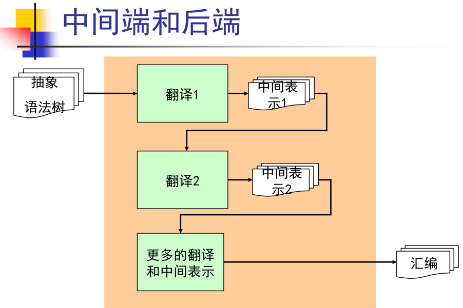

为什么要划分成不同的中间表示？

- 编译器工程上的考虑
    - 阶段划分：把整个编译过程划分成不同的阶段
    - 任务分解：每个阶段只处理翻译过程的一个步骤
    - 代码工程：代码更容易实现、除错、维护和演进
- 程序分析和代码优化的需要 
    - 两者都和程序的中间表示密切相关，许多优化在特定的中间表示上才可以或才容易进行
    - 课程后续我们继续深入这一话题

中间代码形式：

- 树和有向无环图（DAG）：高层表示，适用于程序源代码
- 三地址码（3-address code）：低层表示，靠近目标机器 
- 控制流图（CFG）：更精细的三地址码，程序的图状表示，适合做程序分析、程序优化等 
- 静态单赋值形式（SSA）：更精细的控制流图，同时编码控制流信息和数据流信息  
- 连续传递风格（CPS）：更一般的SSA

### 二、三地址码

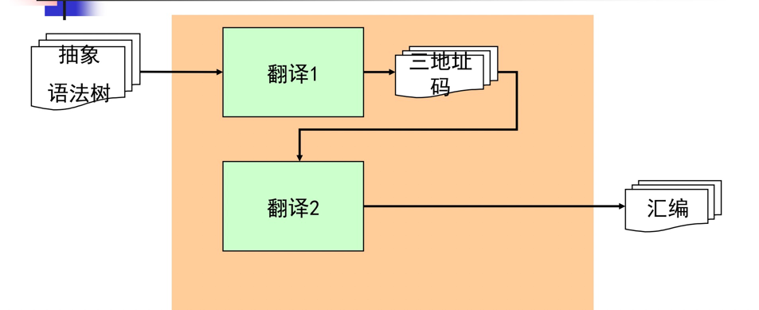

- 给每个中间变量和计算结果命名，没有复合表达式，只有原子操作
- 只有最基本的控制流，没有各种控制结构，只有goto，call等
- 所以三地址码可以看成是抽象的指令集，通用的RISC

````
a = 3 + 4 * 5;
if (x < y)
  z = 6;
else
  z = 7;
  
x_1 = 4;
x_2 = 5;
x_3 = x_1 * x_2;//对每个中间变量命名
x_4 = 3;
x_5 = x_4 + x_3;
a = x_5;

Cjmp (x<y, L_1, L_2);//两种条件地址
L_1:
  z = 6;
  jmp L_3;
L_2:
  z = 7;
  jmp L_3;
L_3:
  …
````

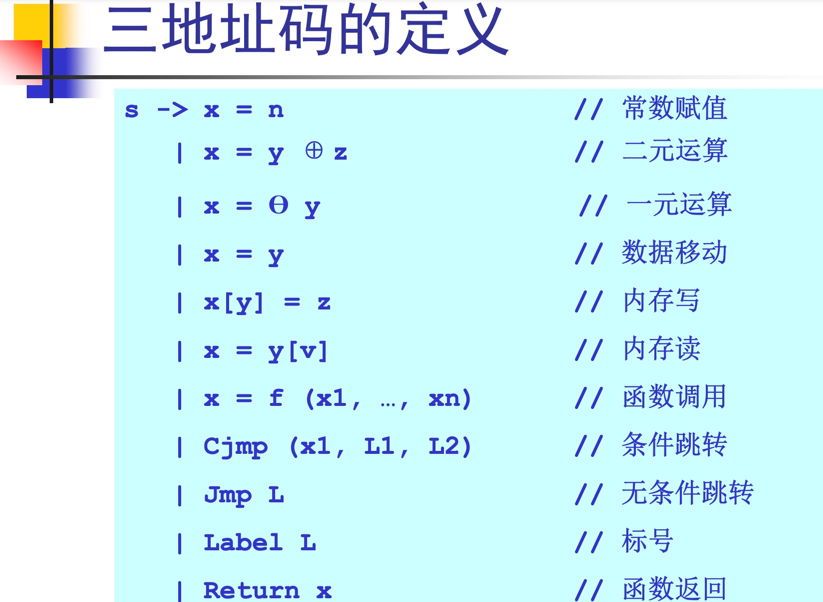

数据结构：
````
enum instr_kind {INSTR_CONST, INSTR_MOVE, …};
struct Instr_t {enum instr_kind kind;};

struct Instr_Add {
  enum instr_kind kind;
  char *x;
  char *y;
  char *z;
};

struct Instr_Move {
  …;
};
````
````
E -> n
  | x
  | true
  | false
  | E + E
  | E && E

P -> F*
F -> x ((T id,)*) { (T id;)* S*}
T -> int
  | bool
S -> x = E
  | printi (E)
  | printb (E)
  | x (E1, …, En)
  | return E
  | if (E, S*, S*)
  | while (E, S*)

Gen_P(P); Gen_F(F); Gen_T(T);
Gen_S(S); Gen_E(E);
````

语句的代码生成
````
Gen_S(S s)
  switch (s)
  case x=e:
    x1 = Gen_E(e);
    emit(“x = x1”);
    break;
  case printi(e):
    x = Gen_E(e);
    emit (“printi(x)”);
    break;
  case printb(e):
    x = Gen_E(e);
    emit (“printb(x)”);
    break;
    
  case x(e1, …, en)://函数调用
    x1 = Gen_E(e1);
    …;
    xn = Gen_E(en);
    emit(“x(x1, …, xn)”);
    break;
  case return e;
    x = Gen_E(e);
    emit (“return x”);
    break;
    
  case if(e, s1, s2)://条件跳转
    x = Gen_E(e);
    emit (“Cjmp(x, L1, L2)”);
    emit (“Label L1:”);
    Gen_SList(s1);
    emit (“jmp L3”);
    emit (“Label L2:”);
    Gen_SList (s2);
    emit (“jmp L3”);
    emit (“Label L3:”);
    break;
    
  case while(e, s):
    emit (“Label L1:”);
    x = Gen_E(e);
    emit (“Cjmp(x, L2, L3)”);
    emit (“Label L2:”);
    Gen_SList(s);
    emit (“jmp L1”);
    emit (“Label L3:”);
    break;
````

三地址码的优点：
- 所有的操作是原子的变量！没有复合结构
- 控制流结构被简化了，只有跳转
- 是抽象的机器代码，向后做代码生成更容易

三地址码的不足：
- 程序的控制流信息是隐式的
- 可以做进一步的控制流分析

### 三、控制流图

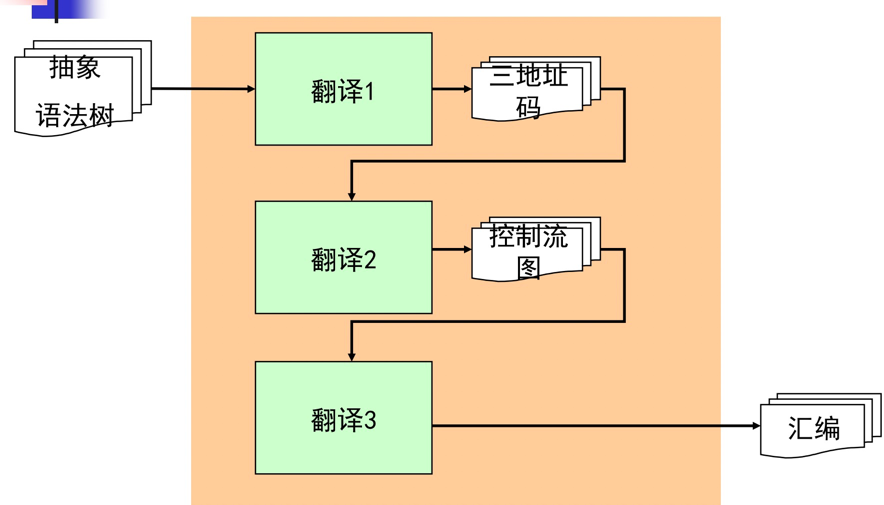

由于三地址码线性结构不直观，使用图的表示方法


控制流图的优势：
- 控制流分析，如程序中是否存在循环？
- 数据流分析，如程序第5行的变量x可能的值是什么？
- 现代编译器的早期阶段就会倾向做控制流分析，方便后续阶段的分析

基本概念：
- 基本块：是语句的一个序列，从第一条执行到最后一条，不能从中间进入，不能从中间退出
- 控制流图：控制流图是一个有向图G=(V, E)

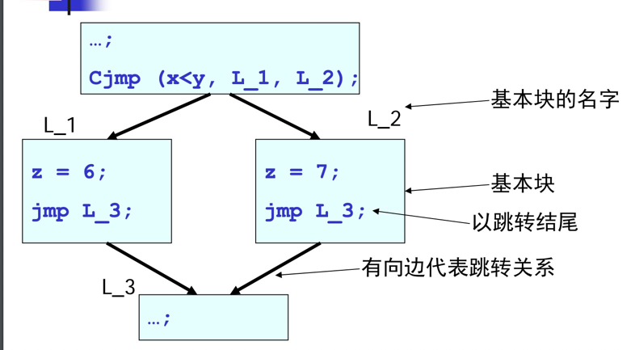

控制流图的定义:
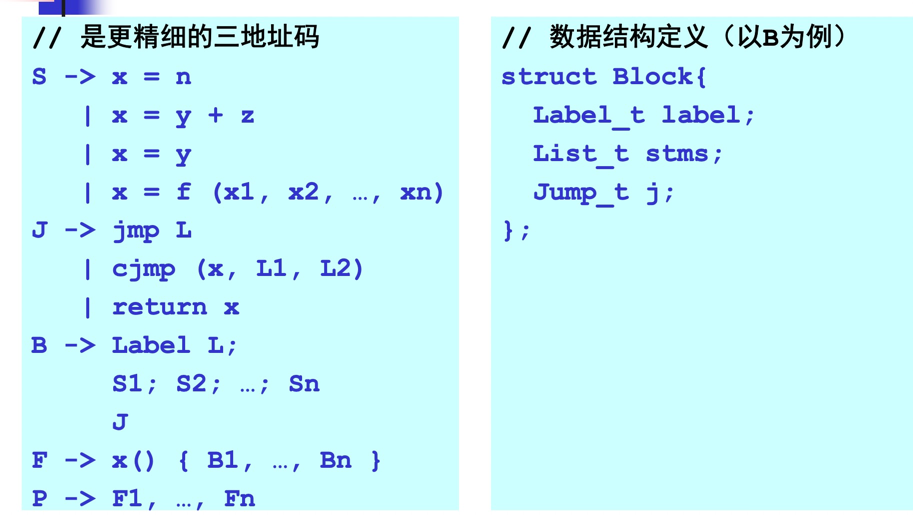

如何生成控制流图:
- 可以直接从抽象语法树生成，可以直接从抽象语法树生成
- 也可以先生成三地址码，然后继续生成控制流图，对于像C这样的语言更合适，更加通用（阶段划分！）

线性扫描算法：
````
List_t stms; // 三地址码中所有语句
List_t blocks = {}; // 控制流图中的所有基本块
Block_t b = Block_fresh(); // 一个初始的空的基本块
scan_stms ()
  foreach(s  stms)
    if (s is “Label L”) // s是标号
      b.label = L;
    else (s is some jump) // s是跳转
      b.j = s;
      blocks
      ∪= {b};
      b = Block_fresh ();
    else // s是普通指令
      b.stms
      ∪= {s};
````

控制流图的基本操作：
- 标准的图论算法都可以用在控制流图的操作上:各种遍历算法、生成树、必经节点结构等等
- 图节点的顺序有重要的应用:拓扑序、逆拓扑序、近似拓扑序等等

死块消除例：

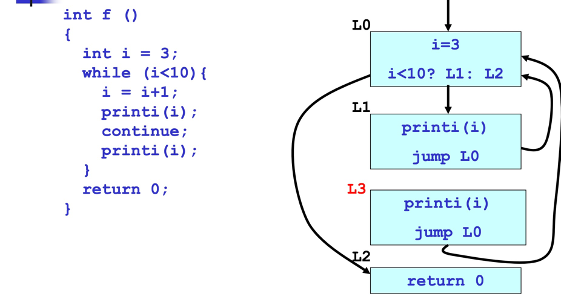
L3处于图中的不可达位置，称为死基本块，无效消耗资源。

可达性算法
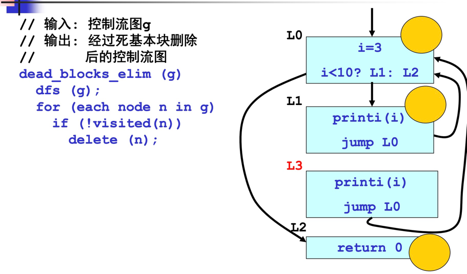

### 四、数据流分析

- 通过对程序代码进行静态分析，得到关于程序数据相关的保守信息，必须保证程序分析的结果是安全的
- 根据优化的目标不同，需要进行的数据流分析也不同
  - 到达定义分析
  - 活性分析
  
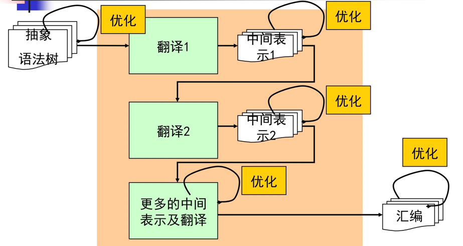

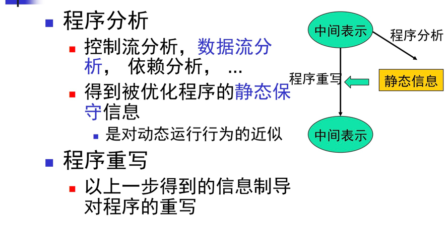

常量传播优化，确定变量是否可以不变
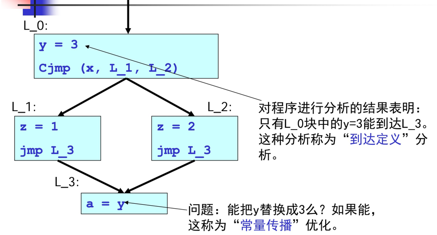
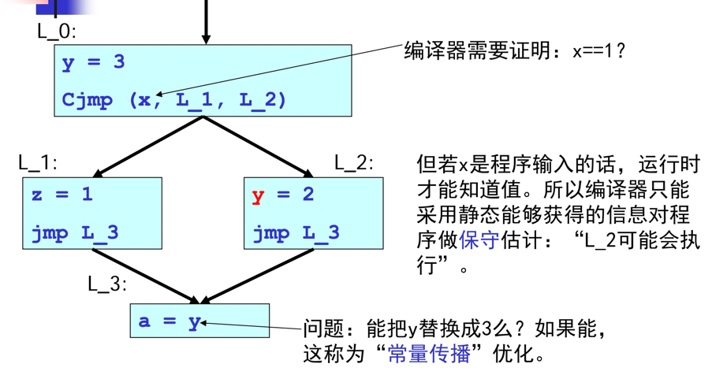
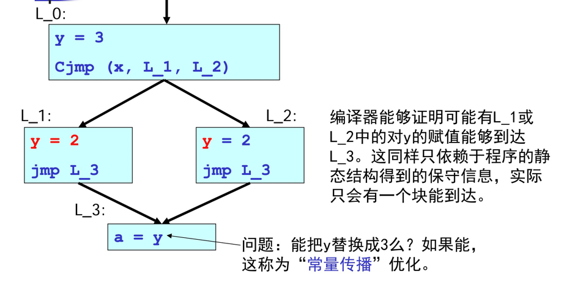

### 五、到达定义分析

定义(def)：对变量的赋值
使用(use)：对变量值的读取

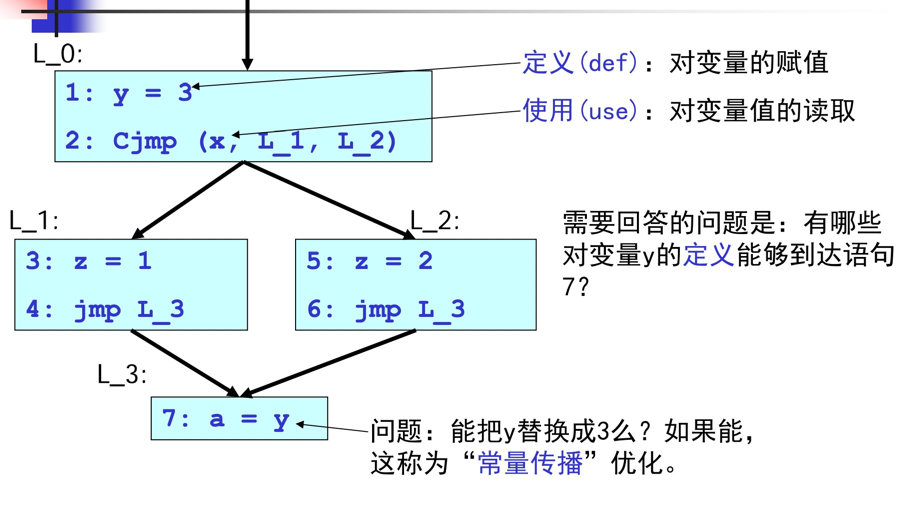

数据流方程： 
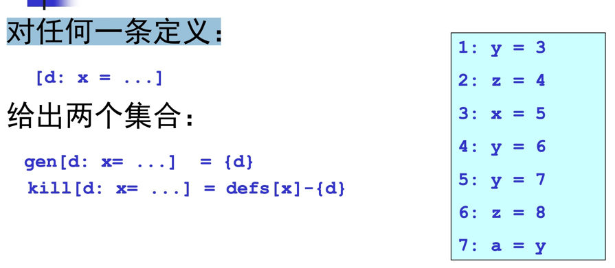
gen集合表示语句，单元素集合，自身定义的语句

kill集合表示，其他定义点减去自身，这些定义点在这里被"杀死"

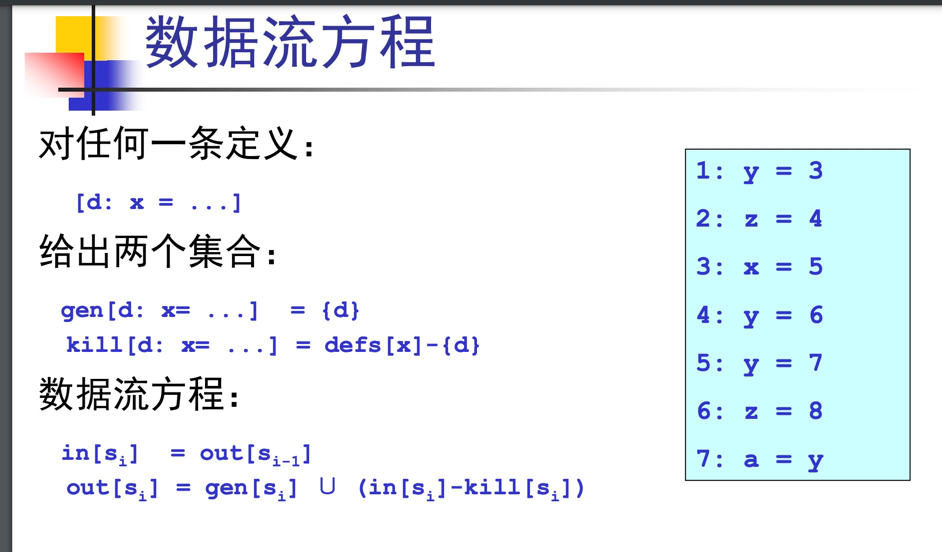

算法：
````
// 算法：对一个基本块的到达定义算法
// 输入：基本块中所有的语句
// 输出：对每个语句计算in
和out两个集合
List_t stms; // 一个基本块中的所有语句
set = {}; // 临时变量，记录当前语句s的in集合
reaching_definition ()
  foreach (sstms)
    in[s] = set;
    out[s] = gen[s]∪(in[s]-kill[s])
    set = out[s]
````

从数据流方程到不动点算法：
````
// 算法：对所有基本块的到达定义算法
// 输入：基本块中所有的语句
// 输出：对每个语句计算in
和out两个集合
List_t stms; // 所有基本块中的所有语句
set = {}; // 临时变量，记录当前语句s的in集合
reaching_definition ()
  while (some set in[] or out[] is still changing)
    foreach (sstms)
      foreach (predecessor p of s)
        set ∪= out[p];
      in[s] = set;
      out[s] = gen[s] ∪ (in[s]-kill[s]);
````

### 六、活性分析

- 在代码生成的讨论中，我们曾假设目标机器有无限多个（虚拟）寄存器可用
  - 简化了代码生成的算法 
  - 对物理机器是个坏消息，机器只有有限多个寄存器，必须把无限多个虚拟寄存器分配到有限个寄存器中
  
- 寄存器分配优化的任务：活性分析


