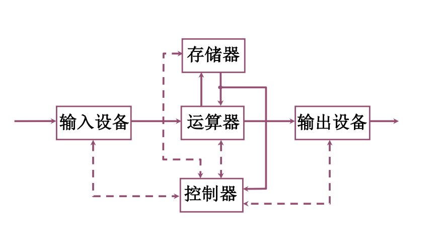
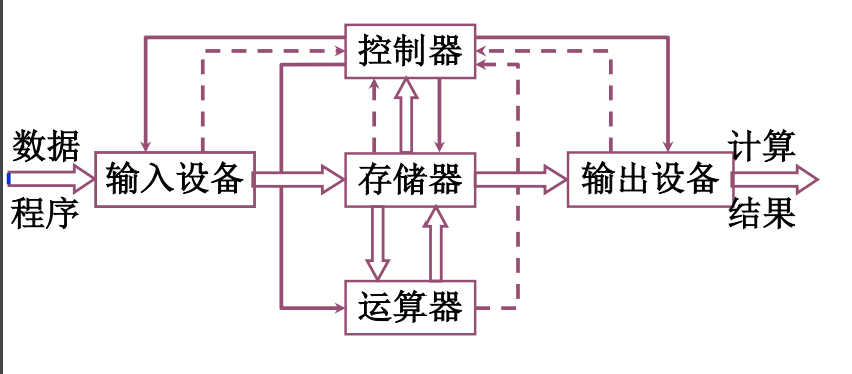

###一.计算机组成概述

#### 1.1组成结构

#### 1.2计算软硬件

- 硬件：计算机实体，主机外设等

- 软件：
    - 系统软件：操作系统，服务性程序，网络软件
    - 应用软件：各类功能性软件
    
#### 1.3语言层次
- 高级语言：可能由编译器翻译为汇编语言程序
- 汇编语言：翻译为机器语言
- 操作系统：用机器语言解释操作系统
- 机器语言：微指令解释机器语言
- 微指令系统：由硬件直接执行微指令

#### 1.4冯诺伊曼结构

- 运算器：主要功能是进行加减乘除等算术运算，还可以进行逻辑运算，又称为ALU（算术逻辑运算部件），计算机中通常采用二进制数，运算器长度一般是8、16、32、64位。
- 存储器：保存一个数的16个触发器称为一个存储单元，存储
  器由许多存储单元组成，每个存储单元有编号，称为地址，存取数据都要按给定的地址来寻找存储单元。存储器所有存储单元的总数称为存储容量，存储容量大的磁盘存储和光盘存储称为外存储器，半导体存储器称为内存储器（内存）。
- 控制器：控制器是计算机中发号施令的部件，控制计算机各部件的工作。
- 输入输出设备
- 系统总线：系统总线是构成计算机系统的骨架，多个系统部件之间进行数据传送的公共通路。

#### 1.5计算机指标

- 吞吐量：表征一台计算机在某 一时间间隔内能够处理的信息量。
- 响应时间：表征从输入有效到系统产生响应之间的时间度量，用时间单位来度量，包括等待时间和处理时间。

- 利用率：在给定的时间间隔内系统被实际使用的时间所占的比率，用百分比表示，实际处理时间/响应时间。
- 处理机字长：指处理机运算器中一次能够完成二进制数运算的位数，如32位、64位。
- 总线宽度：一般指CPU中运算器与存储器之间进行互连的内部总线二进制位数。
- 存储器容量：存储器中所有存储单元的总数目， 通常用KB、MB、GB、TB来表示。
- 存储器带宽：单位时间内从存储器读出的二进制数信息量，一般用字节数/秒表示。
- 主频/时钟周期：CPU的工作节拍受主时钟控制，主时钟不断产生固定频率的时钟，主时钟的频率(f)叫CPU的主频。度量单位是MHz(兆赫兹)、GHz(吉赫兹)。主频的倒数称为CPU时钟周期(T)，T=1/f， 度量单位是μs、ns。

- CPU执行时间：表示CPU执行一般程序所占用的CPU时间，可用下式计算:
- CPU执行时间 = CPU时钟周期数 * CPU时钟周期

- CPI:表示每条指令周期数，即执行一条指令所需的平均时钟周期数。用下式计算:
- CPI = 执行某段程序所需的CPU时钟周期数 + 程序包含的指令条数

- MIPS (Million Instructions Per Second)的缩写，表示平均每秒执行多少百万条定点指令数，用下式计算:
- MIPS = 指令数 + (程序执行时间 * 10^6)

- FLOPS (Floating-point Operations Per Second) 的缩写，表示每秒执行浮点操作的次数，用来衡量机器浮点操作的性能。用下式计算:
- FLOPS = 程序中的浮点操作次数 / 程序执行时间(s)