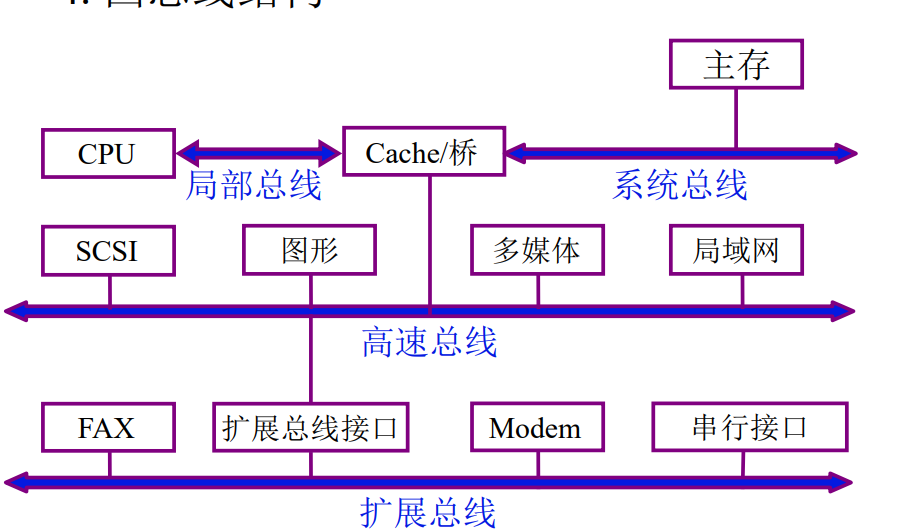
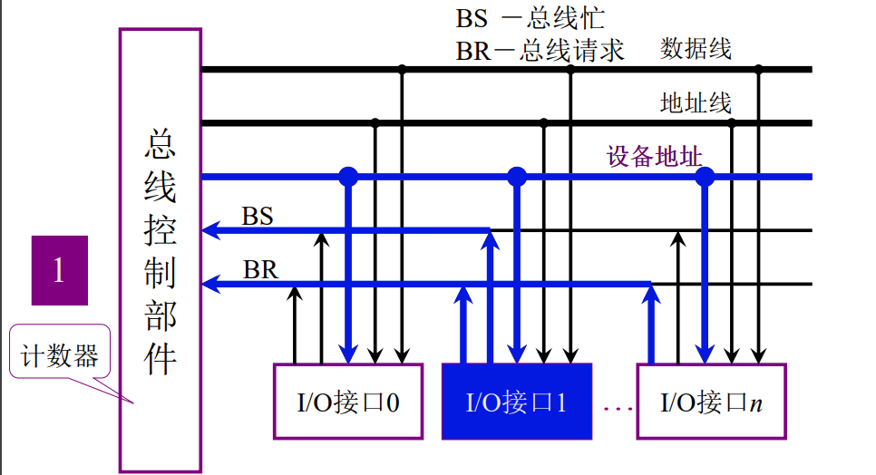

### 一、总线概念

#### 1.1总线定义

总线是连接各个部件的信息传输线，是各个部件共享的传输介质。

总线是构成计算机系统的互联机构，是多个系统功能部件之间进行数据传送的公共通路。借助于总线连接，计算机在各系统功能部件之间实现地址、数据和控制信息的交换，并在争用资源的基础上进行工作。在总线上传输方式有串行和并行两种，由于线路之间会相互干扰，所以传输距离短。

#### 1.2总线分类

- 片内总线：芯片内部的总线
- 系统总线：
    - 数据总线：传输数据，双向与机器字长，存储字长相关。
    - 地址总线：单向，传输数据地址，与存储地址，IO地址相关。
    - 控制总线：传输控制信号，中断，读写请求等。
    
- 通信总线：用于计算机系统之间或者计算机系统与其他系统之间的通信，按照传输方式分为：串行通信和并行通信总线。

#### 1.3总线特性

- 物理特性：总线的物理连接方式（根数、插头、插座形状，引脚排列方式）。
- 功能特性：每根线的功能（地址、数据、控制）。
- 电气特性：每根线上信号的传递方向及有效电平范围。
- 时间特性：规定了每根总线在什么时间有效（时序关系）。

#### 1.4总线指标

- 总线宽度 ：数据线的根数
- 标准传输率 ：每秒传输的最大字节数（MBps）
- 时钟同步/异步 ：同步、不同步
- 总线复用： 地址线与数据线复用
- 信号线数：地址线、数据线和控制线的总和
- 总线控制方式：突发、自动、仲裁、逻辑、计数
- 其他指标：负载能力

### 二、总线连接

- 单总线：在单总线结构中，要求连接到总线上的逻辑部件必须高速运行，以便在某些设备需要使用总线时，能迅速获得总线控制权；而当不再使用总线时，能迅速放弃总线控制权。否则，由于一条总线由多种功能部件共用，可能导致很大的时间延迟。

- 多总线：多总线结构体现了高速、中速、低速设备连接到不同的总线上同时进行工作，以提高总线的效率和吞吐量，而且处理器结构的变化不影响高速总线。

### 三、总线控制

#### 3.1总线判优

- 集中式
  - 链式查询：所有设备通过BR发出申请总线的信号，总线控制部件通过BG线授予某个设备总线控制权，该设备通过BS先发出总线被占用的信号。当有设备发出总线请求信号后，从仲裁器一端开始查询，从左向右的顺序依次查询每个I/O设备，遇到第一个设备请求总线则授予控制权。故离中央仲裁器最近的设备具有最高优先权，离总线控制器越远，优先权越低。
    
    
  - 计数器定时查询：总线上的任一设备要求使用总线时，通过BR线发出总线请求。中央仲裁器接到请求信号以后，在BS线为“0”的情况下让计数器开始计数，计数值通过一组地址线发向各设备。每个设备接口都有一个设备地址判别电路，当地址线上的计数值与请求总线的设备地址相一致时，该设备置“1”BS线，获得了总线使用权，此时中止计数查询。 每次计数可以从“0”开始，也可以从中止点开发始。
    
    
  - 独立请求：在独立请求方式中，每一个共享总线的主设备均有一对总线请求线BRi和总线授权线BGi。当设备要求使用总线时，便发出该设备的请求信号。总线仲裁器中有一个排队电路，它根据一定的优先次序决定首先响应哪个设备的请求，给设备以授权信号BGi。当代总线标准普遍采用独立请求方式。
    
  
#### 3.2总线传输周期
  - 申请分配阶段：主模块申请，总线仲裁决定
  - 寻址阶段：主模块向从模块给出地址和命令
  - 传输阶段：主模块和从模块交换数据
  - 结束阶段：结束传送

#### 3.3总线通信
  - 同步通信：统一时标控制数据传送，出现阻塞
  - 异步通信：采用应答和通知机制，解决阻塞，但系统代价变大
  - 半同步通信
  - 分离式通信：充分挖掘系统总线每个瞬间潜力
    - 充分提高了总线的有效占用
    - 采用同步方式通信，不等对方回答
    - 各模块准备数据时，不占用总线
    - 总线被占用时，无空闲
