### 一、概述

#### 1.1存储器分类

##### 1.按存储介质分类

- 半导体存储器：TTL 、MOS，易失
- 磁表面存储器：磁头、载磁体
- 磁芯存储器：硬磁材料、环状元件
- 光盘存储器：激光、磁光材料

##### 2.按存取方式分类

存取时间与物理地址无关（随机访问）
- 随机存储器：在程序的执行过程中可读可写
- 只读存储器：在程序的执行过程中只读

存取时间与物理地址有关（串行访问）
- 顺序存取存储器 磁带
- 直接存取存储器 磁盘

##### 3.按作用分类
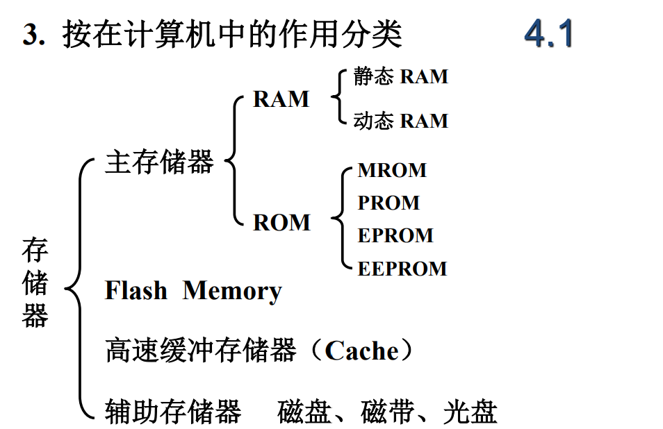

#### 1.2存储器结构
 
三个特性
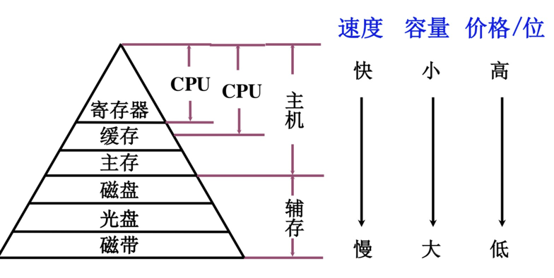

层次结构
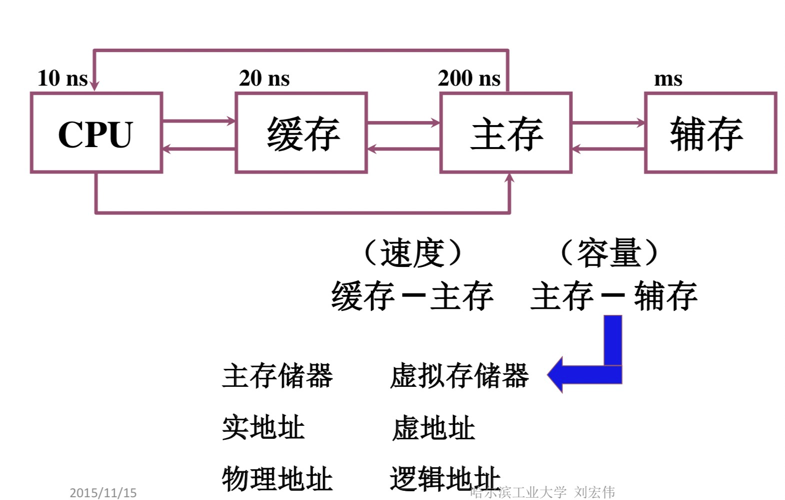

- 高速缓冲存储器（缓存）简称cache，它是计算机系统中的一个高速小容量半导体存储器。
- 主存储器简称主存，是计算机系统的主要存储器，用来存放计算机运行期间的大量程序和数据。
- 外存储器简称外存（辅存），它是大容量辅助存储器。

高速缓冲存储器（缓存）简称cache，它是计算机系统中的一个高速小容量半导体存储器。
主存储器简称主存，是计算机系统的主要存储器，用来存放计算机运行期间的大量程序和数据。
外存储器简称外存（辅存），它是大容量辅助存储器。

### 二、主存储器

存放一个机器字的存储单元，通常称为字存储单元，相应的单元地址叫字地址。而存放一个字节的单元，称为字节存储单元，相应的地址称为字节地址。如果计算机中可编址的最小单位是字存储单元，则该计算机称为按字寻址的计算机。

#### 2.1基本组成

- 存储体：存储体由许多存储单元组成，每个存储单元又包含若干个存储元件，每个存储元件可以寄存一位二进制代码0/1。

- 存储单位：以8位二进制作为一个存储单元，也就是一个字节。一个存储单元可以存储一串二进制代码，称这串二进制代码为一个存储字，代码位数位存储字长。存储单元有编号，这些编号称为存储单元的地址号。存储单元按地址寻访。这些地址都是二进制的形式。

存储体相当于一栋大楼，大楼内有很多房间（存储单元），每个房间内又有很多床位（存储元件），那么0代表床上无人，1代表床上有人。

- MAR：存储器地址寄存器。保存了存储单元的地址（编号）。其位数反映存储单元的个数。

比如有16个存储单元，而存储单元的地址是用二进制表示的，那么用4位二进制数就可以表示。MAR的位数就是4位。所以MAR反映存储单元的个数。

- MDR：存储器数据寄存器，其位数反映存储字长。存放的是：存储器中从存储某单元读出、或要写入某存储单元的数据（代码）。如果MDR=8，每个存储单元进行访问时，数据是8位，存储字长8位。

#### 2.2主存和CPU
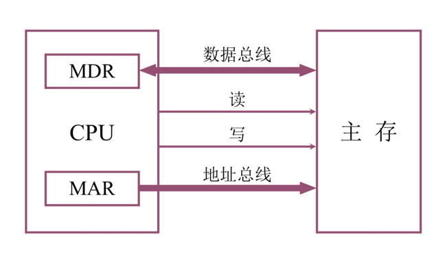

要想完成一个完整的取或存操作，CPU（控制器）还得给主存加以各种控制信号（读命令、写命令、地址译码驱动信号等）。

现代计算机中：

1.主存由半导体集成电路构成

2.驱动器、译码器和读写电路均在存储芯片中

3.MAR和MDR在CPU芯片中

4.存储芯片和CPU芯片可以通过总线（系统总线）连接

5.地址总线用来指出存储单元地址号。

#### 2.3主存单元地址
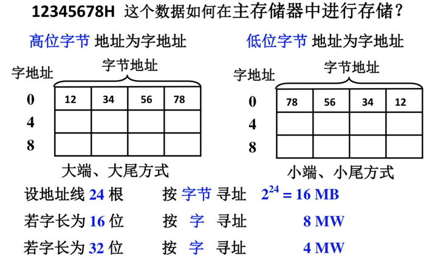

上图中的表格，一小格代表一个存储单元，大方块是主存中的存储体。以8位二进制作为一个存储单元，也就是一个字节。通常，字由字节组成，图中，4个存储单元又构成了1个字，每个字有字地址（左边的0、4、8）。如果字的高有效位放在内存的低地址端，称为大端（大尾）方式，反之称为小端（小尾）方式。

1.地址线24根，一共可以寻找到2^24个字节的地址，故寻址范围为16MB（B表示字节）。
2.字长为16位，也就是说一个字由两个字节组成，如果同样是24根地址线，那么按照字寻址，可以找到 16 / 2 = 8MW 的字，W = word。
3.同样的，32位说明一个字由4个字节组成，一共有16/4 = 4 MW。

#### 2.4技术指标

- 存储容量：主存 存放二进制代码的总位数
- 存取时间：存储器的访问时间，读出时间和写入时间
- 存储周期：连续两次独立的存储器操作（读或写）所需的最小间隔时间，读周期和写周期。
- 存储器带宽 位/秒

### 三、半导体存储芯片

#### 3.1基本结构

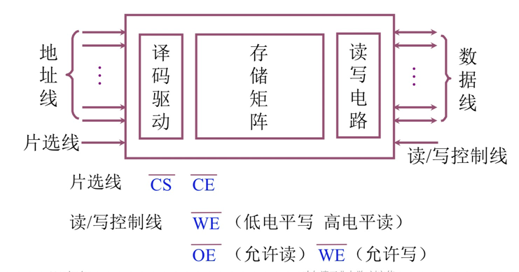

- 地址线是单向输入的，其位数与芯片的容量有关。
- 数据线是双向的(有的芯片可用成对出现的数据线分别作用输入或输出)，其位数与芯片可读出或写入的数据位数有关，其位数与芯片的容量有关。
- 读\写控制线，控制芯片读写操作，WE为写控制信号，OE为读控制信号，都是低电平有效。
- 片选线，有CS和CE两种，分别为芯片选择器和芯片使能器。
- 地址线和数据线共同来反应存储芯片的容量，比如地址线10根，数据线4根，芯片容量为2^10 x 4 = 4K位

地址线反应存储单元个数，数据反应数据存储字长。

#### 3.2片选线

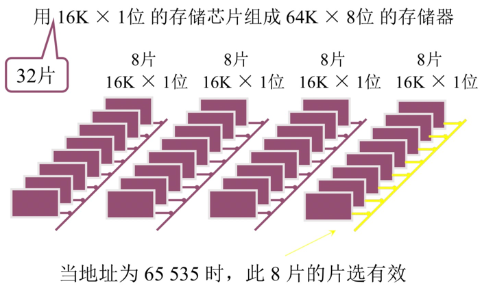

用8片存储芯片组成一个 16K×8位 的芯片组，一个芯片输出一位，8个同时进行读写，同时受一个片选线控制。再用四组上述芯片组，构成一个容量为64K的存储器。当地址为65535（2^64-1）时 应该对最后一组芯片进行读写操作，则最后一组片选线低电平有效，其他的片选线保持高电平无效。

#### 3.3译码驱动方式

- 线选法
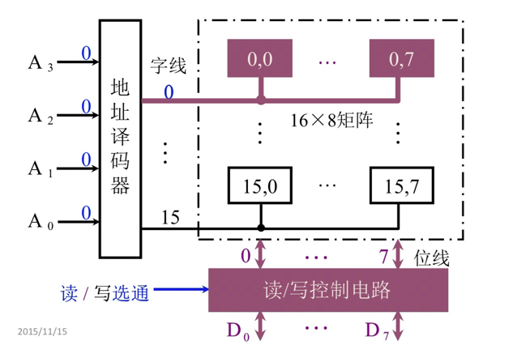

用一个地址译码器来寻址，例如输入0000，则表示寻找地址为0的存储单元，对其进行读写操作。这种驱动方式的缺点是，如果地址线很多，比如有20条，那么就能表示1M条地址，相应地译码器的输出也就有1M条线，近百万条的电路是很不现实的，所以在大规模存储元件就无法使用线选法。

- 重合法（矩阵实现）

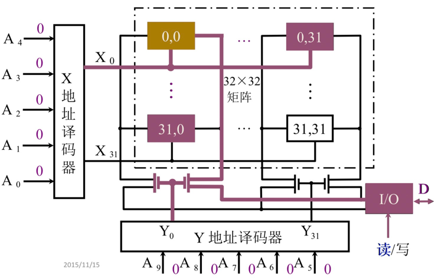

将存储单元排列成一个二维矩阵，X地址译码器表示二维矩阵的第一维，Y地址译码器表示二维矩阵第二维，比如X输入0000，Y输入0000，表示对坐标为（0,0）的存储单元进行读写。

### 四、静态随机存取存储器SRAM

静态RAM(Static Random Access Memory,SRAM)，触发器实现

#### 4.1基本电路

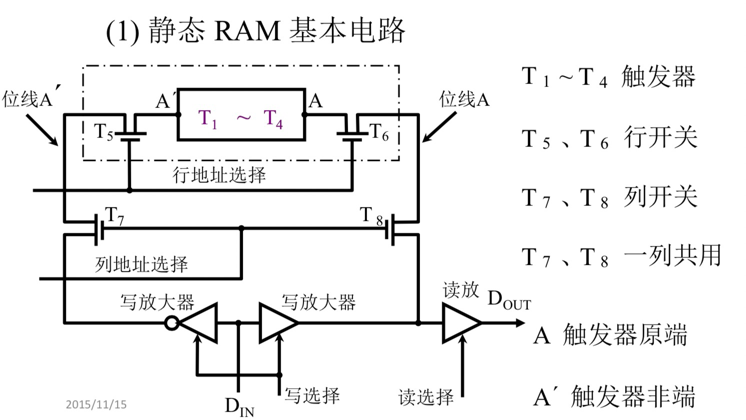

T1到T4为一个触发器，两端为输入端，A^’为触发器非原端（即反相输入，输入信号为0，触发器内记录为1），A为触发器原端，对应地，左边的写放大器做了取反处理，就是因为左边为触发器的非原端。

T5T6为行开关，同时打开表示这一行打通，信号可以在这一条路上流通（就是一个三极管，看成一个闸门，控制左右两端的连通）。

T7T8为列开关，类似行开关，同时打开表示此列打通。

#### 4.2读操作

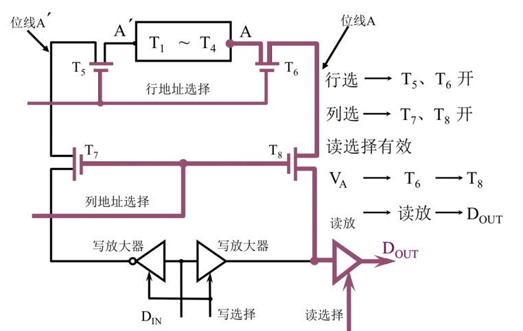

分别打开行列选择线，对应图中紫色的线路打通，数据从A端向下从Dout流出。

#### 4.3写操作

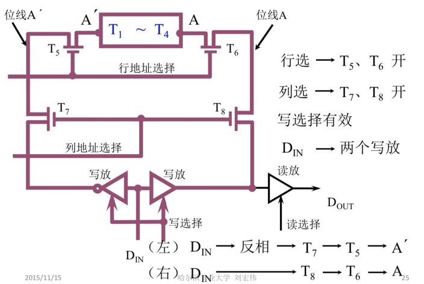

#### 4.4时序电路

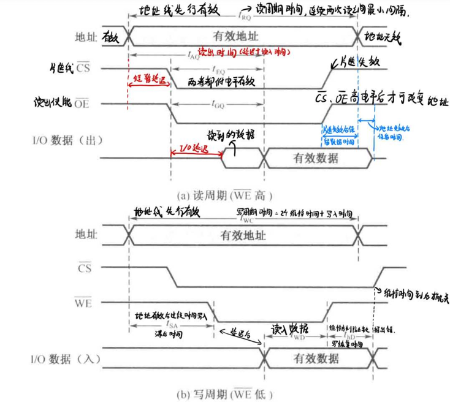

### 五、动态随机存取存储器DRAM

动态RAM，电容实现。

#### 5.1基本电路

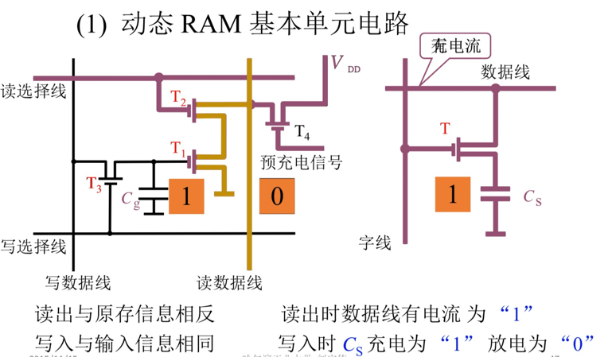

MOS晶体管和电容器组成的单管DRAM记忆电路，MOS管作为开关，电容器存储信息，电荷满表示1，电荷空表示0。

- 写入操作：输出缓冲器和刷新缓冲器关闭，输入数据送到存储元位线上，行选线为高打开MOS管，位线上的信号对电容器进行充放电过程，实现写入操作。
- 读出操作：写入缓冲器和刷新缓冲器关闭，输出缓冲器和行选线为高打开MOS管，电容器进行充放电，信号通过位线送到输出端，实现读出操作。
- 刷新操作：读出过程破坏电容上存储的信号，要重新写入，即刷新。读出过程可以完成刷新，读出信号后通过刷新缓存器重新对电容充放电，实现重新写入数据。

#### 5.2读写时序

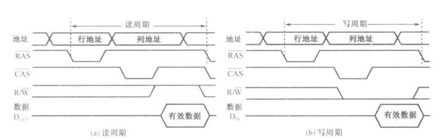

#### 5.3动态刷新

- 集中刷新：每一个刷新周期中集中一段时间对DRAM的所有行进行一次刷新，对于一次刷新周期来说，一般前半段时间由来读写操作，后面留出一部分时间专门用于刷新，且刷新和读写互斥，故会出现一段时间无法进行读写，称为死区。

- 分散式刷新：刷新时间被均匀地分配到刷新周期里面，无死区，但是刷新次数过多，产生很大无用刷新。

- 分散刷新与集中刷新相结合(异步刷新)：将刷新时间划分成几块，每小块进行集中刷新，宏观开起来又是分散式刷新，虽然还是存在死区，但是将刷新安排在指令译码阶段，就不会出现 “死区”。

#### 5.4比较

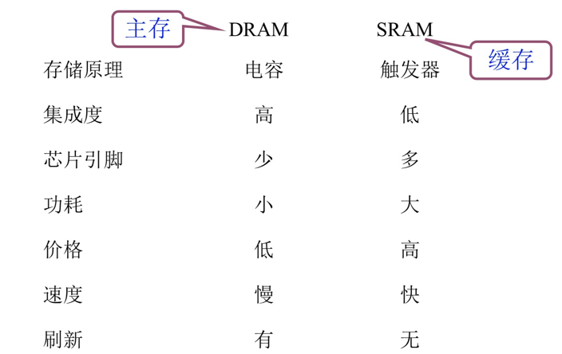

触发器实现和电容实现

- SRAM采用6个晶体管和1个触发器作为一个存储单元，设计复杂，集成度低，价格高，功耗大，由于SRAM不需要刷新所以速度较快,速度快的要求导致其使用单行译码，行译码的限制使其存储容量小，以上特点使其一般用于CPU cache。

- DRAM采用一个晶体管和一个电容作为一个存储单元，需要刷新，存储容量大但是速度较慢，一般作为主存。

### 六、只读存储器ROM

只读存储器，ROM和RAM都属于内存，RAM断电数据消失，ROM断电数据可以保存。

对于电脑而言，ROM一般存储一些系统相关信息和开机引导BIOS等，**ROM不是硬盘，硬盘是外存**。

对于手机而言，ROM称为闪存，就是手机容量。

ROM虽然称为只读存储器，但现在的ROM都支持修改，U盘也是ROM技术。

只支持一次写入 -> 可擦拭多次写入 -> 电可擦拭

- PROM一次编程：熔丝实现
- EPROM：MOS电路，电擦拭多次写入

### 七、Cache

由于主存速度远低于CPU处理速度，为了提高效率，在cpu和主存之间缓存，本质上还是空间换时间。同时缓存的设计也使用了局部性原理。

#### 7.1工作原理

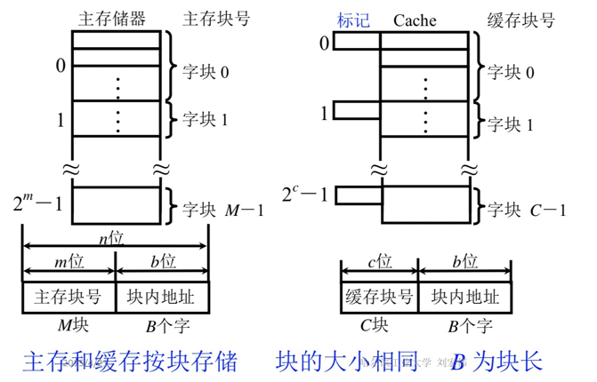

缓存和主存的地址都分为两部分，其中两者的块内地址相等，块内地址的大小决定了块的大小，比如块内地址为4位，并且编址方式为字节，则每块大小为16字节。另外，cache中还存在一个标记，用于标识当前cache块对应的主存块号。

CPU通过地址总线发送主存块号，由于Cache和主存的块内地址编号相同，可以直接转换。主存块号先经过主存Cache地址映射变换机构判断是否命中:

- 如果命中则给出相应的Cache地址的块号，然后从Cache存储体中取数据通过数据总线送给CPU。
- 如果未命中，则查看Cache是否已满：
    - 如果未满，则通过主存块号访问主存，将数据装入Cache，Cache和主存有一条直接通路。
    - 如果已满，则经过Cache替换机构，通过替换算法，判断是否替换Cache的数据，以及和谁替换。
    - 与此同时，主存将CPU所需的数据通过数据总线直接交给CPU

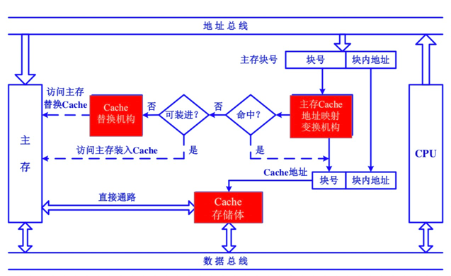

#### 7.2缓存效率

主存和缓存按块存储，块的大小相同，若缓存共有C块，主存共有M块，那么M远远大于C，CPU在主存中申请数据，如果这一块数据已经在缓存中了，则直接从缓存中调入CPU，这称为命中，否则表示未命中。如果命中，说明主存块和缓存块之间建立了对应关系，用标记记录与某缓存块建立了对应关系的主存块号。

- 命中率：CPU欲访问的信息在Cache中的比率，设c表示通过cache完成存取的总次数，m表示通过主存完成存取的总次数，h定义为命中率，则有h = c / (c + m)

- 缓存效率：
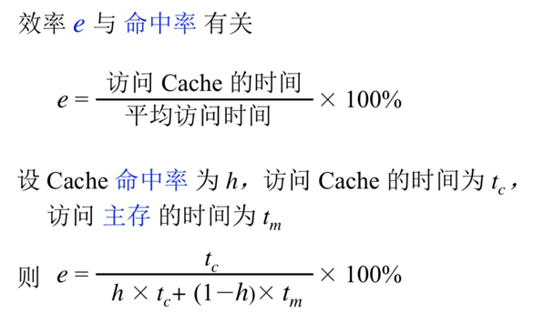
  
#### 7.3cache读

#### 7.4cache写

- 写直达法（Write – through）
  写操作时数据既写入Cache又写入主存，写操作时间就是访问主存的时间，Cache块退出时，不需要对主存执行写操作，更新策略比较容易实现，缺点是：会造成Cache和内存数据的频繁信息交换，如不停进行求和。
  
- 写回法（Write – back）
  写操作时只把数据写入 Cache 而不写入主存，当 Cache 数据被替换出去时才写回主存，无法保证Cache和内存操作时间的一致性，在并行计算机（多个独立Cache和主存）中会出现问题。
  
#### 7.5地址映射

- 直接映射

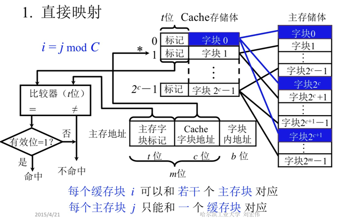

CPU给出的主存地址由三部分组成：主存字块标记，Cache字块地址，字块内地址。

主存字块标记就是主存的分区号；分区内的块号就是cache字块地址；字块内地址就是字块内的偏移地址，在Cache和主存中相同，不用处理。以第0块为例：由于cache中的第0块装的可能是主存中任意一个分区的第0块，所以需要比较主存字块标记和cache上的标记是否相同，如果相同则说明命中。

该方式的缺点是cache的利用率不高，可能会反复换出同一个cache字块而其他字块空闲。

- 全相联映射

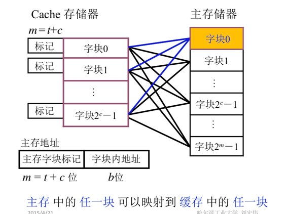

Cache利用率高，只要Cache中有空余则就可以装入。由于可以装入到任意的位置，所以要和Cache所有的块比较判断是否命中，比较次数多。同时主存字块标记要存m位（即主存块号），比较的位数也多，时间慢，电路复杂。

- 组相联映射

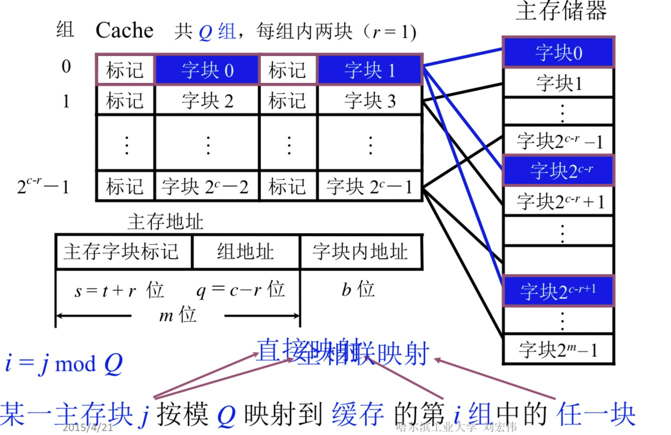

直接映射和全相联映射方式是两个极端，一个只能放在固定位置，一个可以放在所有位置，各自的优缺点也很明显，组相连映射是一种中庸的思路。首先将cache分为Q组，同时将主存进行分区，每个区的块数等于cache的组数，每个区的第i块只能放在cache的第i组中，但是在组中的位置可以任意。

某一主存块按模映射到缓存的第q组中的任一块，其中主存块第i块只能放在特定的第j组中，属于直接映射的思想，而可以放在特定组中任意一块，属于全相连映射的思想。

主存地址的组成如图所示，在cache中查找时，先根据组地址（即j mod Q）找到cache对应的组，然后通过若干个并行的比较器（个数由每组块数决定）比较主存字块标记（即主存的分区号），只要有一个命中则命中。

#### 7.6替换算啊

- FIFO算法

- LRU算法

