### 一、概述

#### 1.1发展阶段

串行连接，分散查询 -> 并行工作（中断模式，DMA模式）-> 具有通道结构 -> IO机处理阶段

#### 1.2 IO组成

- IO指令
- 设备选址
- 传送方式

#### 1.3联络方式

- 同步阻塞
- 异步应答
- 同步时标工作

### 二、IO设备

大致分为人机交互设备，机器存储设备，机机通讯设备

- 输入设备：键盘，鼠标，触控屏
- 输出设备：屏幕，打印设备
- 其他

### 三、程序查询

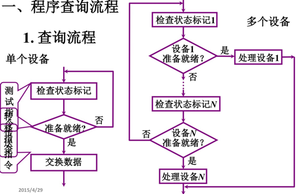

CPU和IO串行连接，有踏步等待。

#### 四、中断

#### 4.1中断接口电路

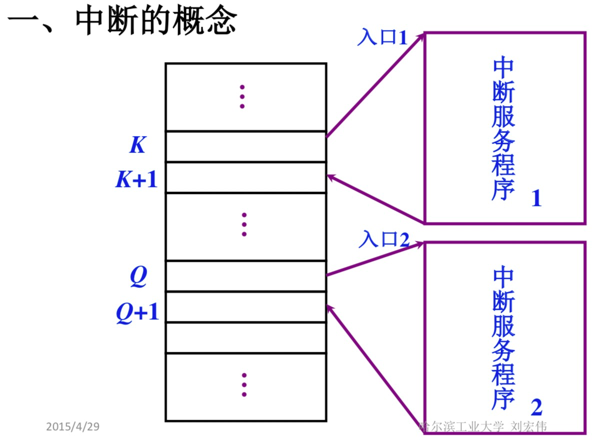
通过中断请求和响应的方式工作。

1.配置中断请求触发器和中断屏蔽触发器 
2.排队器
3.中断向量地址形成部件
4.程序中断方式接口电路的基本组成

接口电流组成：

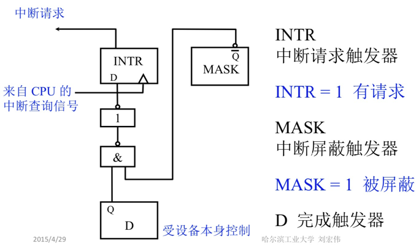

#### 4.2中断处理过程

1.cpu响应中断

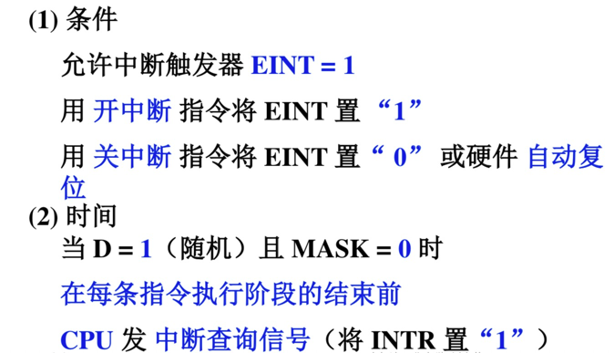

2.IO处理中断

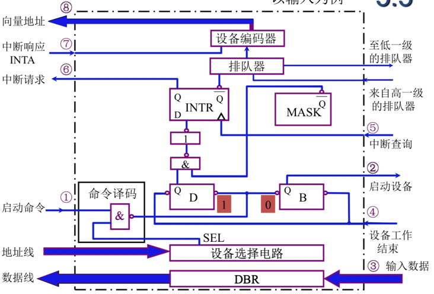

#### 4.3中断服务程序

1.中断流程
- 保护现场
    - 程序断点保护，中断隐指令
    - 寄存器内容保护
    
- 中断服务：执行不同IO设备服务

- 恢复现场：出栈指令

- 中断返回

2.多重中断

允许更高级别的中断源中断现行的中断服务程序。

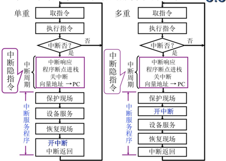

3.抢占CPU

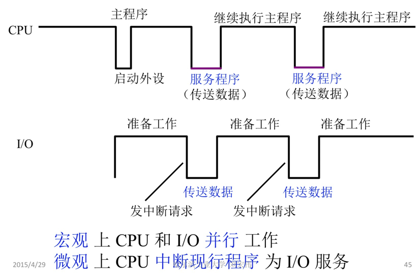

### 五、DMA模式

#### 5.1DMA传送通路

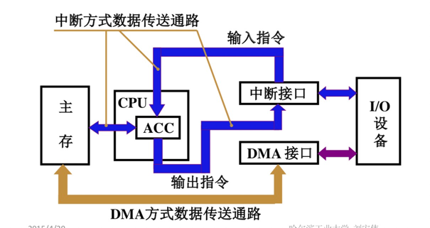

CPU可以不参与其中，通过DMA通路交换主存和IO的数据

#### 5.2交换数据方式

- 停止CPU访问

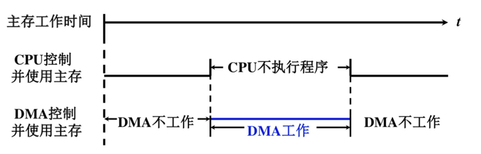

控制简单，但CPU利用率低

- 周期窃取

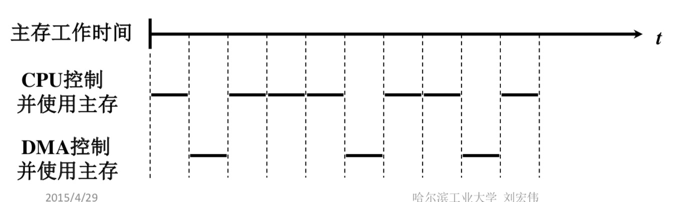

总线控制权一部分交给DMA

- 交替访问

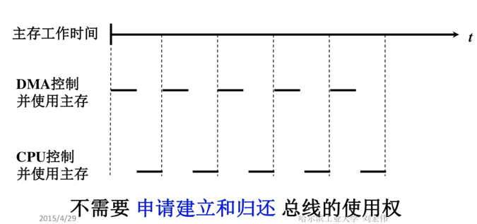

#### 5.3DMA工作过程

1.外设可通过DMA控制器向CPU发出DMA请求:
2.CPU响应DMA请求,系统转变为DMA工作方式,并把总线控制权交给DMA控制器;
3.由DMA控制器发送存储器地址,并决定传送数据块的长度;
4.执行DMA传送;
5.DMA操作结束,并把总线控制权交还CPU。

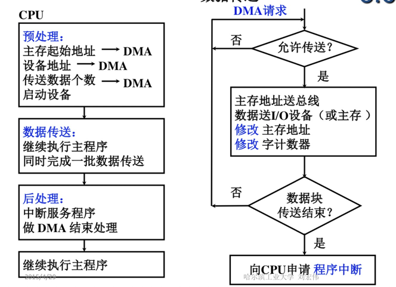
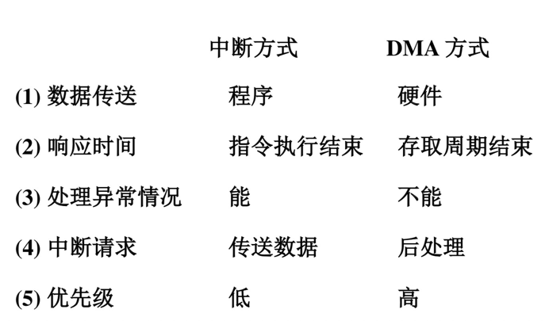

