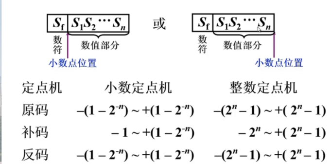
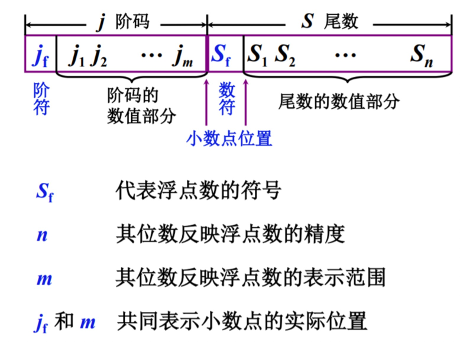
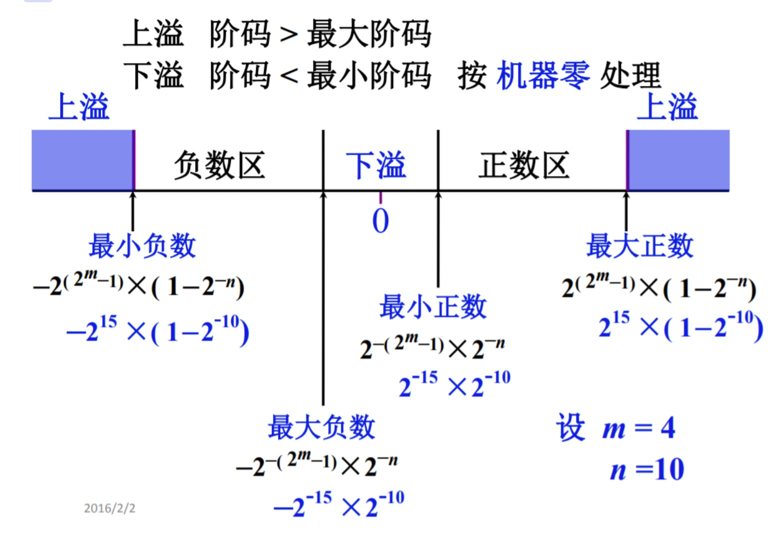
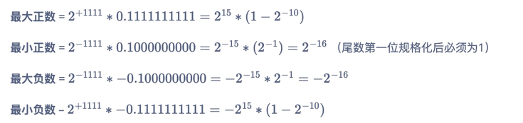
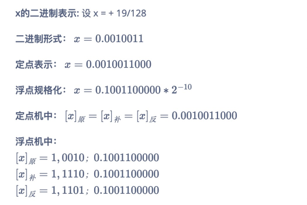
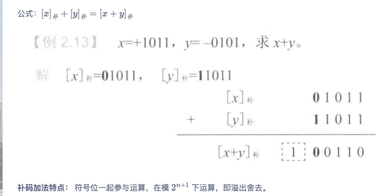
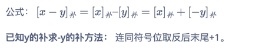
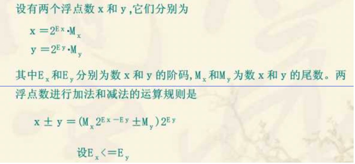
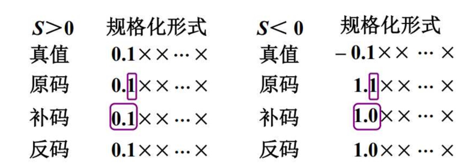
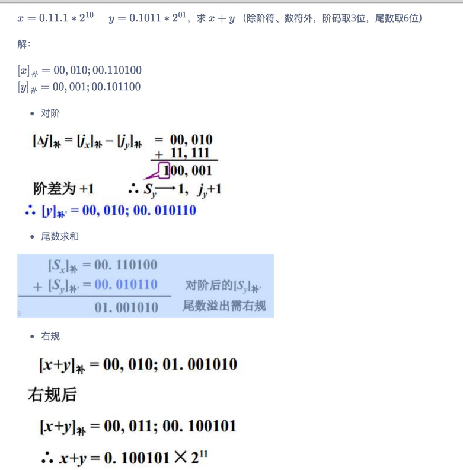

### 一、数据表示

#### 1.1定点表示

定点数指小数点在数中位置固定不变的数。定点数分为定点整数和定点小数，由于小数点位置固定不变，所以存储时小数点不进行存储，按照约定的位置计算数值。原理上讲，小数点的位置可以位于任何位置，但通常将定点数表示成纯小数或纯整数。

任意一个定点数x=xnxn-1…x2x1，其中xn是符号位，0是正数，1是负数

为了解决统计加减符号，减号为加一个数的负数，引入了反码，为了去掉-0，引入了补码。

对于正数：原码 = 反码 = 补码 
对于负数：反码=原码符号位为1不变，其它位取反; 补码=反码+1

#### 1.2浮点表示

把一个数的有效数字和数的范围在计算机的一个存储单元中分别予以表示。这种把数的范围和精度分别表示的方法，相当于数的小数点位置随比例因子的不同而在一定范围内可以自由浮动，所以称为浮点表示法。
其实就是科学计数法。

牺牲精度为代码换来更大的存储范围。

计算机中任意二进制数表示为：N=2^e.M

如1.1 * 2 ^ 20，M尾数是1.1，e阶码是20。尾数用定点小数形式表示，指数用定点整数形式表示。

浮点数表示范围：

#### 1.3浮点数规格化

规格化形式：
- 基数 r = 2 ，尾数最高位为 1
- 基数 r = 4 ，尾数最高 2 位不全为 0 
- 基数 r = 8 ，尾数最高 3 位不全为 0

基数不同，浮点数的规格化形式不同。

基数r越大，可表示的浮点数的范围越大，基数r越大，浮点数的精度降低。

例：设 m = 4，n = 10，r = 2，求尾数规格化后的浮点数表示范围。

例：将 x = + 19/128 写成二进制定点数、浮点数及在定点机和浮点机中的机器数形式。其中数值部分均取 10 位，数符取 1 位，浮点数阶码取 5 位（含1位阶符），尾数规格化。

### 二、定点运算

1.加法

2.减法

溢出处理：采用双符号位检测溢出，符号位为11表示负数，00表示正数，01和10表示溢出，最高符号位表示正确的符号，01为正溢，10为负溢。

3.乘法和除法

加法和移位实现

### 三、浮点运算

1.对阶：浮点数的阶数不同无法运算，第一步需要对齐，将两个浮点数的阶码用补码表示，做相减运算得出需要移动的位数。遵守小阶向大阶看齐的原则，即小阶的尾数向右移，每移一位，阶码+1。

2.尾数加减：与定点加减法运算一样，采用补码运算。

3.结果规格化：

对于补码，规格化要求符号位和第一数位不同。
- 左规：结果是00.00…001…或者11.11…110…这种形式的，没有发生溢出，不断地将尾数相对小数点向左移动一位，阶码相应-1，直到符号位和第一数位不同为止。
- 右规：结果是01.xxxx或10.xxxx时，说明发生溢出，需要向右移动，01.xxxx向右移动一位变成00.xxxx，10.xxxx向右移动一位变成11.xxxx，阶码都相应+1。

4.舍入操作

- 0舍1入：类似四舍五入，丢弃的最高位为1，则进1，否则直接舍去。
- 朝0舍入：直接舍去。
- 朝+无穷舍入：正数多余位不全为“0”则进1，负数则截尾。
- 朝-无穷舍入：负数多余位不全为“0”则进1，正数则截尾。

5.溢出处理

- 阶码上溢：超出阶码可能表示的最大值的正指数值，一般认为正无穷和负无穷。
- 阶码下溢：超出阶码可能表示的最小值的负指数值，一般认为0。
- 尾数上溢：尾数右移，阶码+1。
- 尾数下溢：尾数右移时最低有效位从尾数域右端流出，需要进行舍入操作。

例：

