### 一、概述

#### 1.1基本

指令： 就是要计算机执行某种操作的命令。从计算机组成的层次结构分为：

- 微指令：是微程序级的命令，它属于硬件；
- 宏指令：由若干条机器指令组成的软件指令，它属于软件；
- 机器指令：介于微指令与宏指令之间，通常简称为指令，每一条指令可完成一个独立的算术运算或逻辑运算等操作。

一台计算机中所有机器指令的集合，称为这台计算机的指令系统。 指令系统是表征一台计算机性能的重要因素，它的格式与功能不仅直接影响到机器的硬件结构，而且也直接影响到系统软件，影响到机器的适用范围。

#### 1.2指令发展

- 复杂指令系统计算机，简称CISC。但是如此庞大的指令系统不但使计算机的研制周期变长，难以保证正确性，不易调试维护，而且由于采用了大量使用频率很低的复杂指令而造成硬件资源浪费。
- 精简指令系统计算机：简称RISC（Apple的M1），人们又提出了便于VLSI技术实现的精简指令系统计算机。

出现CISC到RISC转变的原因：，2/8现象（只有20%的指令使用率达到80%），控制器设计难度下降

#### 1.3对指令系统性能的要求

- 完备性：完备性是指用汇编语言编写各种程序时，指令系统提供的指令足够使用，而不必用软件来实现。采用硬件指令的目的是提高程序执行速度，便于用户编写程序。
- 有效性：有效性是指利用该指令系统所编写的程序能够高效率地运行。高效率主要表现在程序占据存储空间小、执行速度快。一般来说，一个功能更强、更完善的指令系统，必定有更好的有效性。
- 规整性：规整性包括指令系统的对称性、匀齐性、指令格式和数据格式的一致性。
    - 对称性是指：在指令系统中所有的寄存器和存储器单元都可同等对待，所有的指令都可使用各种寻址方式；
    - 匀齐性是指：一种操作性质的指令可以支持各种不同的数据类型；
    - 指令格式和数据格式的一致性是指：指令长度和数据长度有一定的关系，以方便处理和存取。例如指令长度和数据长度通常是字节长度的整数倍。
- 兼容性：系列机各机种之间具有相同的基本结构和共同的基本指令集，因而指令系统是兼容的，即各机种上基本软件可以通用。

#### 1.4语言和指令 

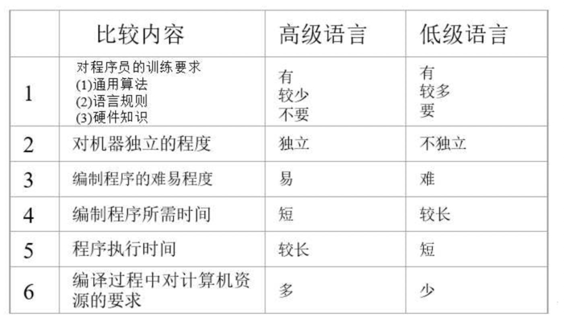

### 二、机器指令

指令的格式：操作码 地址码 寻址方式

指令的字长：固定字长、可变字长

#### 2.1操作码

设计计算机时，对指令系统的每一条指令都要规定一个操作码。指令的操作码OP表示该指令应进行什么性质的操作。不同的指令用操作码字段的不同编码来表示，每一种编码代表一种指令。组成操作码字段的位数一般取决于计算机指令系统的规模。较大的指令系统就需要更多的位数来表示每条特定的指令，按照操作码长度分为：

- 等长：指令规整，译码简单，固定长度编码的主要缺点是：信息的冗余极大，使程序的总长度增加。
- 变长：指令不规整，译码复杂，效率高

操作码拓展技术：
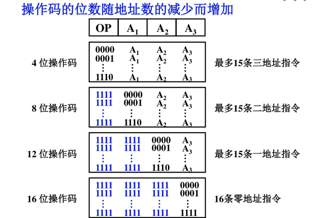

#### 2.2地址码

操作数存放的地址

- 三地址指令：第一操作数，第二操作数，结果地址（a+b=c；）
- 二地址指令：第一操作数，第二操作数，结果存在第一操作数下（a+=b；），按照操作数的物理位置不同分为：
  - RR：寄存器-寄存器类型
  - RS：寄存器-存储器类型
  - SS：存储器-存储器类型
- 单地址指令：第一操作数（a++；）
- 零地址指令：如停机、清除等控制指令

### 三、操作数类型和操作种类

#### 3.1操作数类型

- 地址数据: 地址实际上也是一种形式的数据。（无符号）
- 数值数据: 计算机中普遍使用的三种类型（定点、浮点和十进制数）的数值数据。
- 字符数据: 文本数据或字符串，目前广泛使用ASCII码。
- 逻辑数据: 一个单元中有多位二进制bit项组成，每个bit的值可以是1或0。当数据以这种方式看待时，称为逻辑性数据。

#### 3.2操作数存放方式

- 从任意位置开始存储，读写控制比较复杂。
- 从一个存储字的起始位置开始访问，可能会浪费资源。
- 边界对准方式——从地址的整数倍位置开始访问：按照指令字和机器字长的关系分为：单字长指令（指令字长等于机器）、半字长指令（指令字长等于半个机器）、双字长指令。

#### 3.3操作种类

- 传送操作：如MOVE，LOAD，STORE
- 算数逻辑：ADD，SUB
- 移位操作
- 转移操作：JMP，SKP
- 输入输出：IN，OUT

### 四、寻址方式

#### 4.1指令寻址

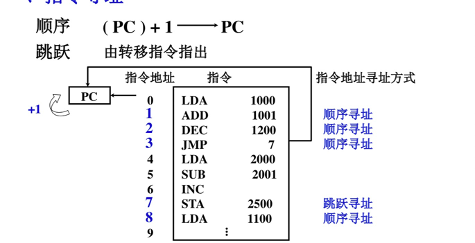

#### 4.2数据寻址

一般格式

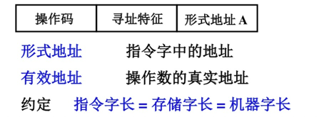

1.立即寻址

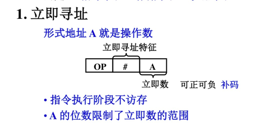
寻址特征为“#”，表示是立即数寻址，形式地址放的就是操作数，执行时无需访存，立即数以补码的形式表示，A的位数限制了立即数的大小。

2.直接寻址

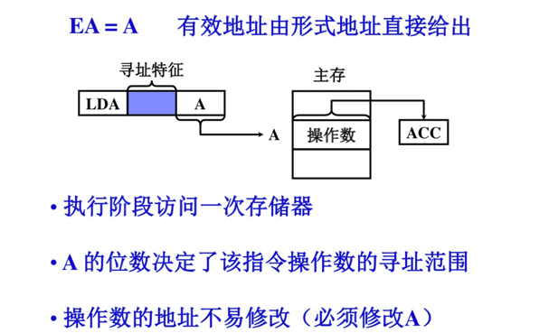
有效地址直接放在形式地址处，执行阶段进行一次访存，A决定了操作数的寻址范围，操作数的地址不易修改（要先找到这条指令，然后将指令上的有效地址修改，较为麻烦）

3.隐含寻址

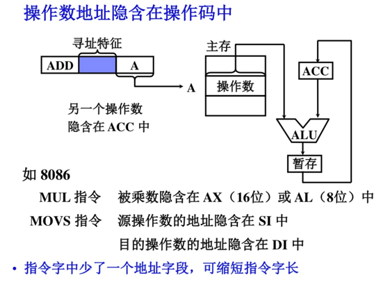

4.间接寻址

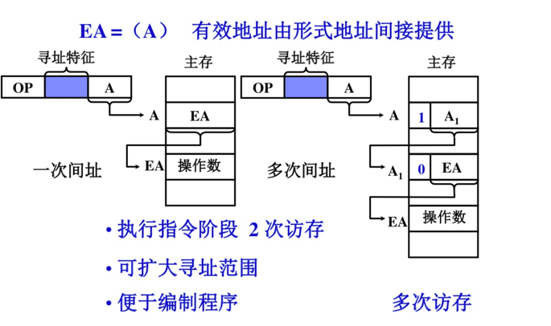
有效地址由形式地址间接提供,分为一次间址，和多次间址，有效地址在主存中的地址存在A中，在主存中找到有效地址后再次访存找到操作数，故执行指令需要两次访存，优点是可以扩大寻址范围（因为EA可以很长），便于编程（操作数修改方便，只要修改EA即可）。

5.寄存器寻址

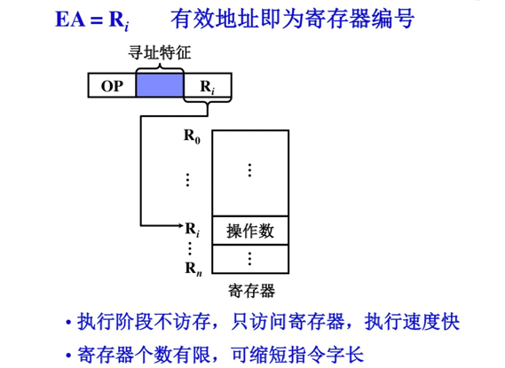
有效地址为寄存器编号，直接访问寄存器即可得到操作数，执行阶段不访存，执行速度快，并且寄存器个数有限，可以缩短指令字长。

6.寄存器间接寻址

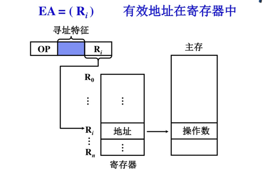
有效地址在寄存器中， 操作数在存储器中，执行阶段访存，便于编制循环程序。

7.基址寻址

采用专用寄存器作基址寄存器
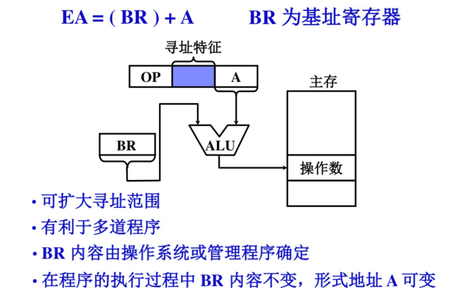

BR 为基址寄存器,，A为偏移量，实际有效地址为基址+偏移量，可扩大寻址范围，BR 内容由操作系统或管理程序确定，在程序的执行过程中 BR 内容不变，形式地址 A 可变。用户不必考虑自己的程序存在于主存的那个空间区域，有利于多道程序设计。
问：为什么利于多道程序设计？
用户无需考虑程序存放在主存中的哪里，只要指出哪个寄存器作为某个程序的基址寄存器即可，由操作系统或管理程序自动分配。分别用不同的寄存器表示多道程序的基址寄存器，程序执行时用户不知道程序在主存中的位置，也不可修改基址寄存器的内容，确保系统安全可靠地运行。

采用通用寄存器作基址寄存器
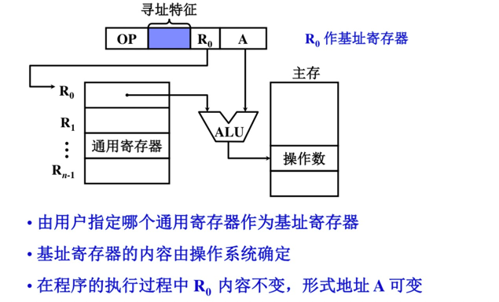

8.变址寻址

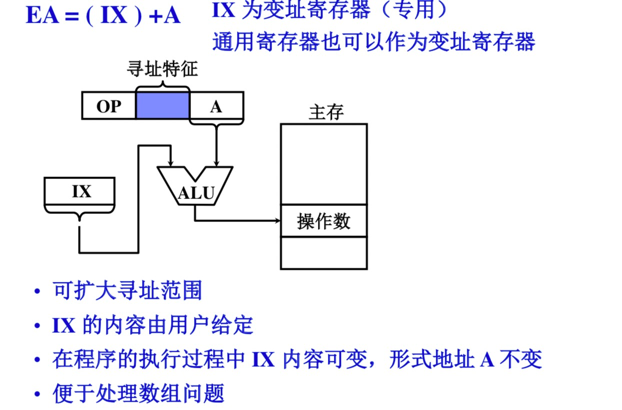
IX 为变址寄存器（专用），通用寄存器也可以作为变址寄存器。可扩大寻址范围，IX 的内容由用户给定，在程序的执行过程中 IX 内容可变，形式地址 A 不变，便于处理数组问题。
为何便于处理数组问题？
答：循环时只要修改寄存器中的内容即可，指令字内存放数组的首地址，只需一个指令就可以完成一次循环操作。如果采用其他的寻址方式，需要不断修改指令字中的形式地址。

9.相对寻址
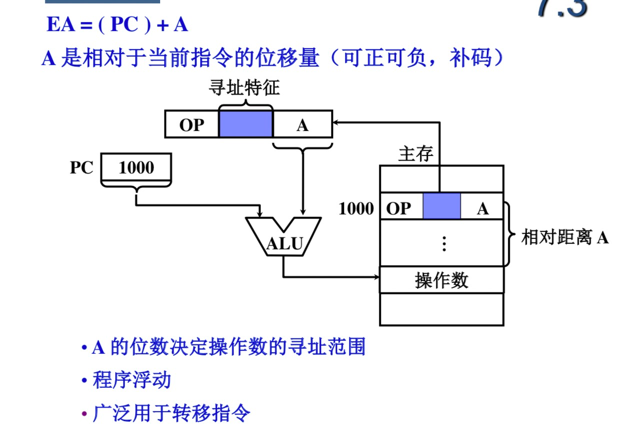

A 是相对于当前指令的位移量（可正可负，补码），A 的位数决定操作数的寻址范围，适合程序浮动，广泛用于转移指令。

浮动程序技术是指在多道程序设计的系统中，要求每道程序存放在主存的任何区域都能正确执行，甚至在执行过程中，当程序的存放区域被改变，也要求其执行不受影响。也就是说，程序可以随机地从主存的一个区域移动到另一个区域，程序被移动后仍丝毫不影响它的执行。

问：跟随指令改变地址，如何保证操作数的准确性？
偏移量A是不停变化的，随着PC的跳转，A也相应加减，使得PC+A指向的数据不变。

10.堆栈寻址
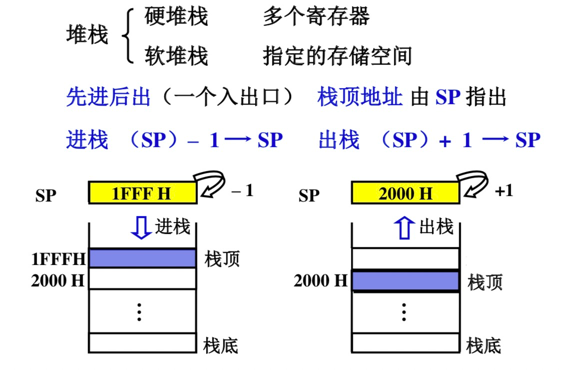

### 五、RISC

20%和80%规律：CISC中大约有20%的指令使用频率高，占据了80%的处理机时间，而有80%的不常用指令只占用处理机的20%时间。

VLSI工艺要求规整性，而大量复杂指令控制逻辑极其不规整，给VLSI工艺造成了很大的困难。

现在用微程序实现复杂指令与用简单指令组成的子程序相比，没有多大的区别。因为现在控制存储器和主存的速度差缩小。

CISC中，通过增强指令系统的功能，简化了软件，增加了硬件的复杂程度。然而指令复杂了，指令的执行时间必然加长，从而使整个系统的执行时间反而增加，因而在计算机体系结构设计中，软硬件的功能分配必须恰当

RISC特点：
- 选用使用频度较高的一些简单指令，复杂指令的功能由简单指令来组合
- 指令长度固定、指令格式种类少、寻址方式少
- 只有LOAD / STORE 指令访存
- CPU中有多个通用寄存器
- 采用流水技术一个时钟周期内完成一条指令
- 采用组合逻辑实现控制器

CISC特点：
- 系统指令复杂庞大，各种指令使用频度相差大
- 指令长度不固定、指令格式种类多、寻址方式多
- 访存指令不受限制
- CPU中设有专用寄存器
- 大多数指令需要多个时钟周期执行完毕
- 采用微程序控制器

比较：

1.RISC更能充分利用VLSI芯片的面积
2.RISC更能提高计算机运算速度，指令数、指令格式、寻址方式少，通用寄存器多，采用组合逻辑，便于实现指令流水
3.RISC便于设计，可降低成本，提高可靠性 
4.RISC不易实现指令系统兼容

