- 指令控制（程序的顺序控制）
- 操作控制（一条指令由若干操作信号实现）
- 时间控制（指令各个操作实施时间的定时）
- 数据加工（算术运算和逻辑运算）

### 一、CPU结构

#### 1.1CPU结构图
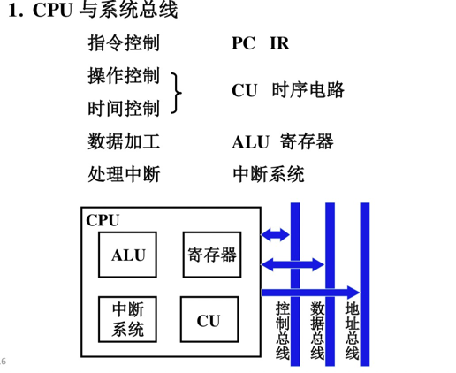

中央处理器CPU=运算器+控制器+Cache：
- 运算器：ALU+通用寄存器+数据缓冲寄存器+状态条件寄存器，进行算术逻辑运算
- 控制器：组成：程序计数器、指令寄存器、指令译码器、时序产生器和操作控制器组成。 
    - 指令Cache中取出一条指令，并指出下条指令的在指存中的地址 
    - 对指令进行译码和分析，产生相应的控制信号，完成规定的动作
    - 指挥并控制CPU、数存和输入输出设备间数据的流动方向
    
#### 1.2CPU寄存器

1.数据寄存器

数据寄存器（Data Register，DR）又称数据缓冲寄存器，其主要功能是作为CPU和主存、外设之间信息传输的中转站，用以弥补CPU和主存、外设之间操作速度上的差异。

数据寄存器用来暂时存放由主存储器读出的一条指令或一个数据字；反之，当向主存存入一条指令或一个数据字时，也将它们暂时存放在数据寄存器中。

数据寄存器的作用是 ：

- 作为CPU和主存、外围设备之间信息传送的中转站；

- 弥补CPU和主存、外围设备之间在操作速度上的差异；

- 在单累加器结构的运算器中，数据寄存器还可兼作操作数寄存器

2.指令寄存器

指令寄存器（Instruction Register，IR）用来保存当前正在执行的一条指令。

当执行一条指令时，首先把该指令从主存读取到数据寄存器中，然后再传送至指令寄存器。

指令包括操作码和地址码两个字段，为了执行指令，必须对操作码进行测试，识别出所要求的操作，指令译码器（Instruction Decoder，ID）就是完成这项工作的。指令译码器对指令寄存器的操作码部分进行译码，以产生指令所要求操作的控制电位，并将其送到微操作控制线路上，在时序部件定时信号的作用下，产生具体的操作控制信号。

指令寄存器中操作码字段的输出就是指令译码器的输入。操作码一经译码，即可向操作控制器发出具体操作的特定信号。

3.程序计数器

程序计数器（Program Counter，PC）用来指出下一条指令在主存储器中的地址。

在程序执行之前，首先必须将程序的首地址，即程序第一条指令所在主存单元的地址送入PC，因此PC的内容即是从主存提取的第一条指令的地址。

当执行指令时，CPU能自动递增PC的内容，使其始终保存将要执行的下一条指令的主存地址，为取下一条指令做好准备。若为单字长指令，则(PC)+1，若为双字长指令，则(PC)+2，以此类推。

但是，当遇到转移指令时，下一条指令的地址将由转移指令的地址码字段来指定，而不是像通常的那样通过顺序递增PC的内容来取得。

因此，程序计数器的结构应当是具有寄存信息和计数两种功能的结构。

4.地址寄存器

地址寄存器（Address Register，AR）用来保存CPU当前所访问的主存单元的地址。

由于在主存和CPU之间存在操作速度上的差异，所以必须使用地址寄存器来暂时保存主存的地址信息，直到主存的存取操作完成为止。

当CPU和主存进行信息交换，即CPU向主存存入数据/指令或者从主存读出数据/指令时，都要使用地址寄存器和数据寄存器。

如果我们把外围设备与主存单元进行统一编址，那么，当CPU和外围设备交换信息时，我们同样要使用地址寄存器和数据寄存器。

5.程序状态字寄存器

程序状态字（Program Status Word，PSW）用来表征当前运算的状态及程序的工作方式。

程序状态字寄存器用来保存由算术/逻辑指令运行或测试的结果所建立起来的各种条件码内容，如运算结果进/借位标志（C）、运算结果溢出标志（O）、运算结果为零标志（Z）、运算结果为负标志（N）、运算结果符号标志（S）等，这些标志位通常用1位触发器来保存。

除此之外，程序状态字寄存器还用来保存中断和系统工作状态等信息，以便CPU和系统及时了解机器运行状态和程序运行状态。

因此，程序状态字寄存器是一个保存各种状态条件标志的寄存器

### 二、指令周期

- 指令周期：取指令、分析指令到执行完该指令所需的全部时间，即取指周期+执行周期。
- 机器周期： 通常又称CPU周期或者总线周期，通常把一条指令周期划分为若干个机器周期，每个机器周期完成一个基本操作。不同的指令，可能包含不同数目的机器周期。
一般按照主存的工作周期(存取周期)为基础来规定CPU周期，比如，可以用CPU读取一个指令字的最短时间来规定CPU周期。
  
- 时钟周期：在一个机器周期内，要完成若干个微操作。这些微操作有的可以同时执行，有的需要按先后次序串行执行。因而需要把一个机器周期分为若干个相等的时间段，每一个时间段称为一个节拍，就称为时钟周期，它是再不能进一步分割的最小时间单位。节拍常用具有一定宽度的电位信号表示，称之为节拍电位。

条指令周期划分为若干个机器周期，一条指令周期划分为若干个机器周期。

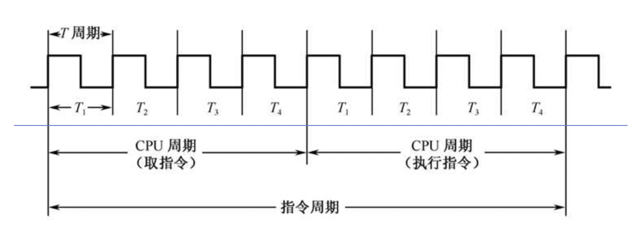

1.如NOP等操作，指令周期只有取指阶段
2.如ADD操作，指令周期有取指阶段和执行阶段
3.如果有间址操作，那么有取指阶段，间址阶段和执行阶段
4.如果可以中断，那么有取指阶段，间址阶段，执行阶段和中断阶段

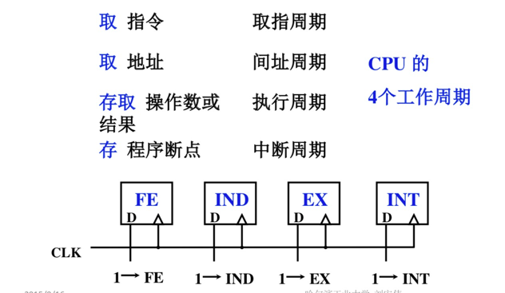

#### 数据流

1.取指周期数据流
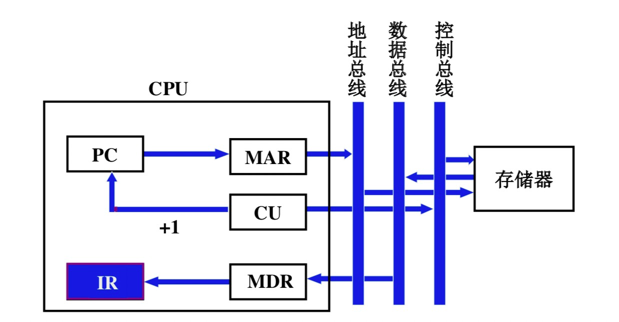

2.间址周期数据流
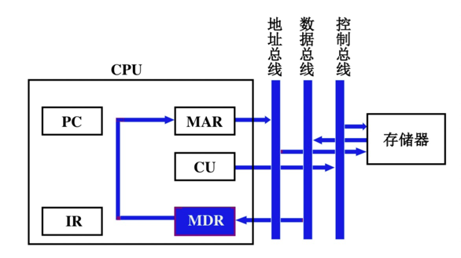

3.执行周期数据流

4.中断周期数据流
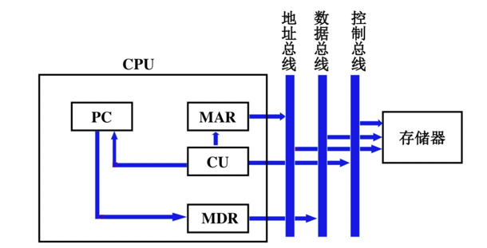

#### 例：ADD操作指令
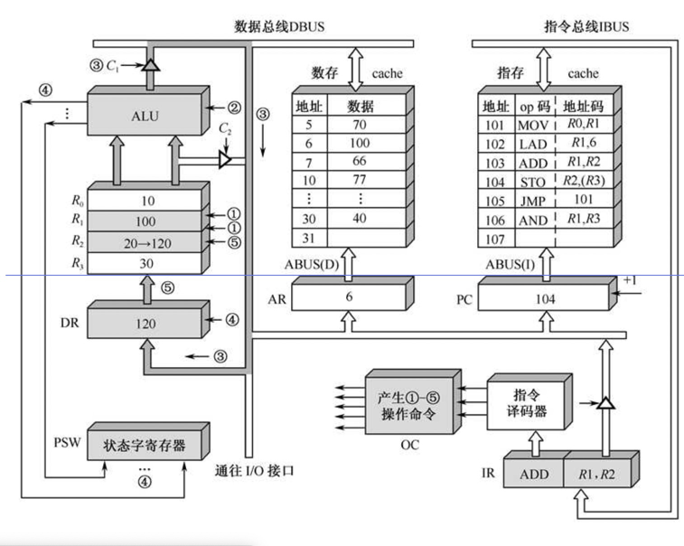

1.分别取出R1和R2的数据，放入ALU。
2.经过R1和R2的数据经过ALU运算。
3.ALU的数据进入数据总线。
4.数据存入数据寄存器，同时修改状态字寄存器。
5.将数据存入R2。

### 三、流水线系统

并发：两个或两个以上事件在同一时间段发生
并行：两个或两个以上事件在同一时刻发生

进程，线程的并行由软件控制，指令级的并行由硬件控制。

#### 3.1执行原理

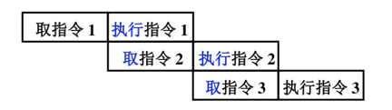
若取指和执行阶段时间上完全重叠指令周期减半速度提高1倍。

显然如果执行阶段大于取指阶段，效率就会下降，所以可以引入指令缓冲区。
而如果出现跳转指令，也会出现已读入的指令失效情况，引入CPU分支预测。

六级流水模型
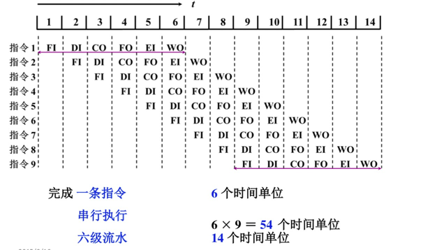

取指模型
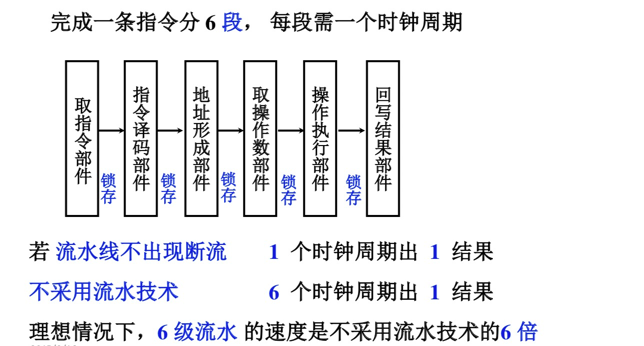

浮点运算模型
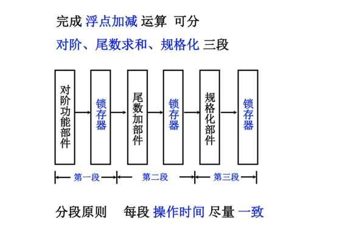

#### 3.2流水线性能

1.吞吐率
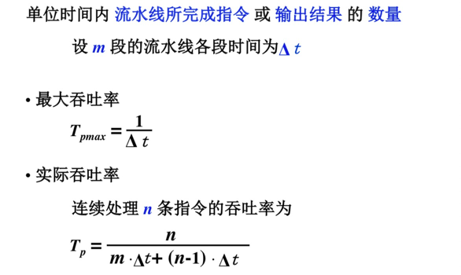

2.加速比
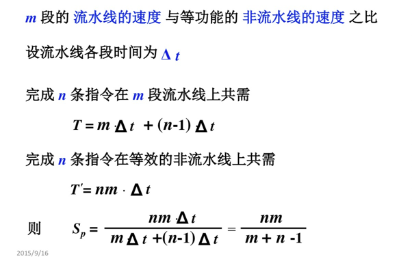

3.效率
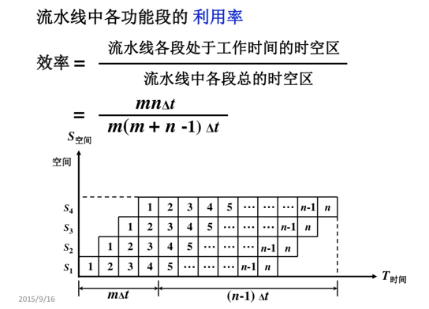

#### 3.3流水线多发技术

1.超标量技术
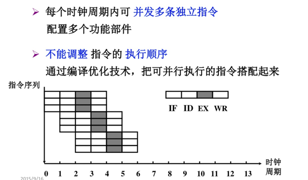

2.超流水线技术
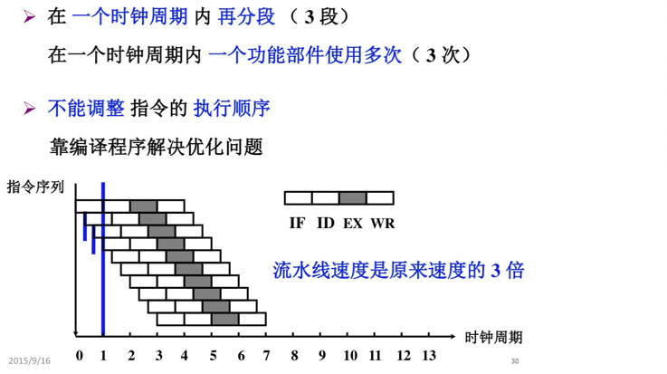

3.超长指令字技术
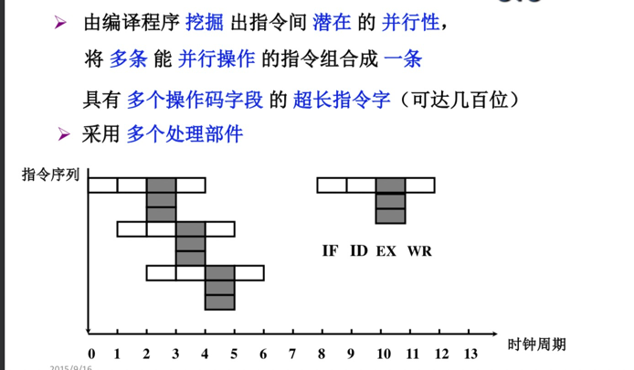

### 四、中断

#### 4.1中断请求和判定

多个INTR组成中断请求触发寄存器，INTR分散在各个中断源的接口电路上，最后体现在中断寄存器上
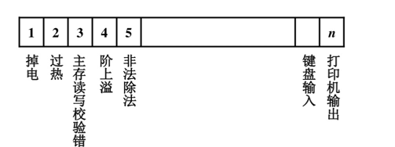

对于中断的判定
- 硬件实现：排队器
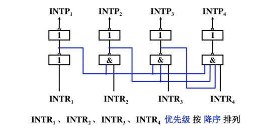
  
- 软件实现（程序主动查询）
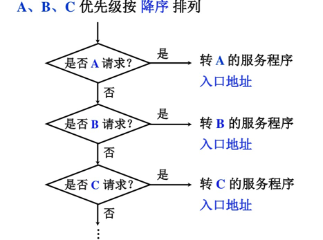
  
#### 4.2中断服务程序入口地址的寻找

1.硬件向量法
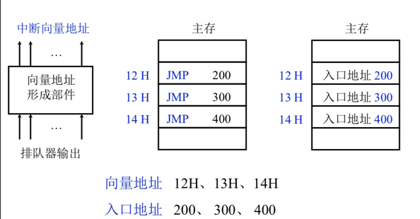

2.软件查询
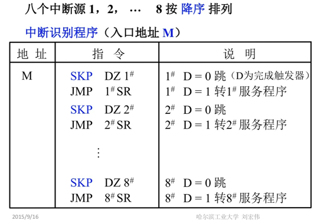

#### 4.3保护和恢复现场

- 断点部分：由中断隐指令完成
- 数据部分：由寄存器转入内存中

中断隐指令不需要手动实现
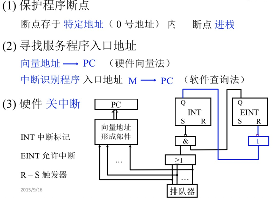

中断服务处理完成后恢复现场
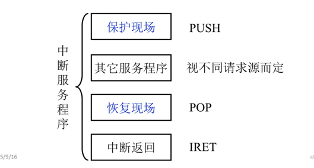

#### 4.4多重中断

基于中断优先级和屏蔽器技术

### 五、控制单元CU

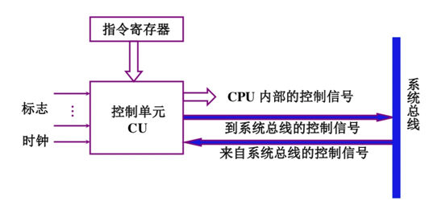

1.输入信号

- 时钟信号
- 指令寄存器：其他组件发起的指令
- 标志
- 外来信号：INTR中断请求，总线请求等

2.输出信号

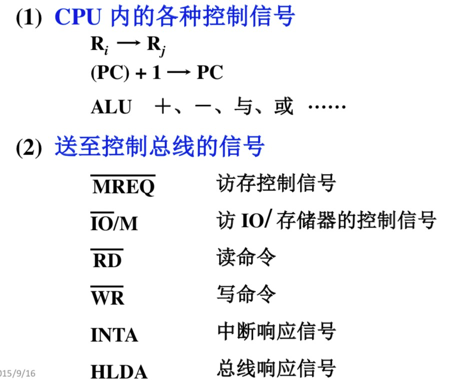

#### 例：不采用CPU内部线的ADD指令

1.取指周期

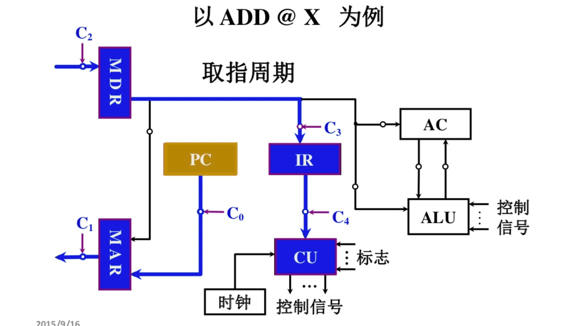

2.间址周期

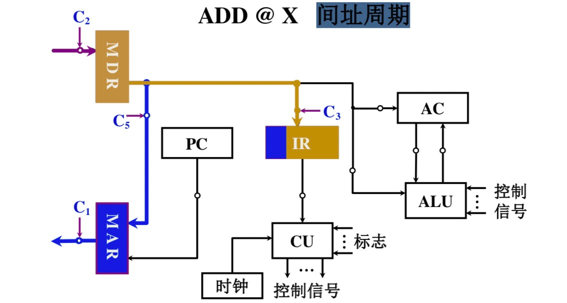

3.执行周期
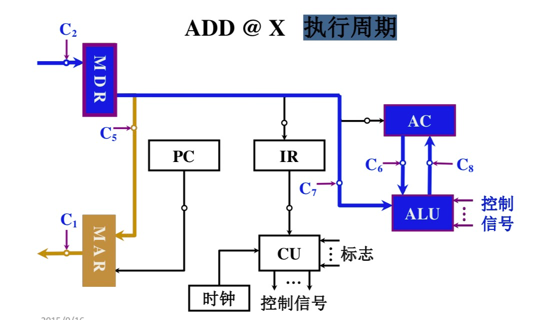

#### 采用CPU内部线的ADD指令

各部件通过CPU内部总线连接，不直接连接。
1.取指周期

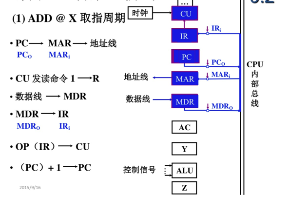

2.间址周期

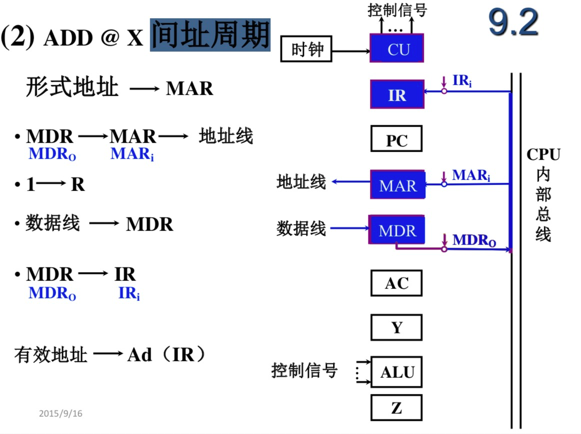

3.执行周期

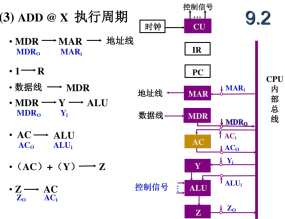

### 六、其他

多级时序：机器周期、节拍(状态)组成多级时序系统，一个指令周期包含若干个机器周期 一个机器周期包含若干个时钟周期。

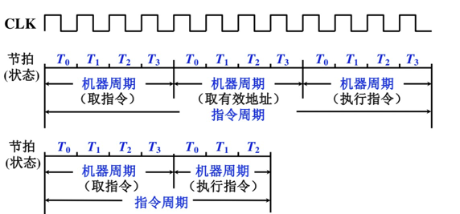

机器速度和主频

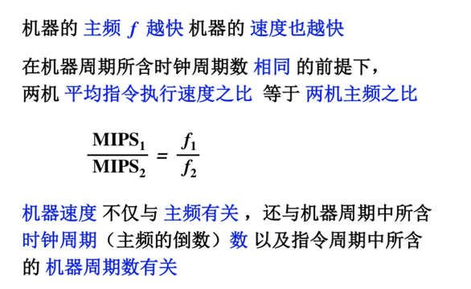

微指令设计：组合逻辑（硬件相关，速度快，不易更改），微程序设计（软件设计）

